# Two-Tower Recommender

A production-oriented, end-to-end candidate-retrieval platform built with Python 3.12,
PyTorch, Parquet, FAISS/exact vector search, FastAPI, MLflow-compatible tracking, and
Prometheus metrics. The default workflow generates structured synthetic behavior and runs
without private data, cloud credentials, a GPU, Redis, or PostgreSQL.

This system implements **retrieval**, not a complete recommendation stack. It reduces a
catalog to a manageable candidate set. A production system normally follows retrieval with a
cross-feature ranker, policy filtering, re-ranking, and online experimentation.

## Architecture

```mermaid
flowchart LR
  Raw[Raw entities and events] --> Quality[Validation and quarantine]
  Quality --> Split[Temporal splits]
  Split --> Features[Train-fitted feature artifact]
  Features --> Train[Two-tower training]
  Train --> Model[Model + model card]
  Model --> Embed[Item embedding export]
  Embed --> Index[Exact or FAISS index]
  Model --> API[FastAPI runtime]
  Index --> API
  API --> Rules[Filters + diversity/freshness]
  Rules --> Response[Recommendations]
```



The user and item towers independently produce vectors in the same space. In-batch softmax
raises similarity for observed positive pairs relative to other batch items. L2-normalized
embeddings make inner product equal cosine similarity. Duplicate item positives are treated as
multiple positives rather than false negatives.

## Implemented capabilities

- Deterministic synthetic users, items, impressions, clicks, views, carts, purchases, ratings,
  sessions, position bias, temporal cohorts, cold start, long-tail popularity, sparse/active
  users, missing values, duplicates, and invalid quality fixtures.
- Explicit validation reports, deterministic cleanup, event weighting, and globally time-based
  train/validation/test splits.
- Train-only vocabularies and normalizers with padding/unknown handling, multi-hot preferences,
  schema hashes, persisted feature contracts, and training-serving parity.
- Independent PyTorch towers, configurable dimensions/activation/dropout, LayerNorm, Xavier
  initialization, normalized cosine or unnormalized dot embeddings, and multi-positive InfoNCE.
- In-batch, uniform, popularity-weighted, and ANN hard-negative sampling contracts.
- CPU/CUDA training, CUDA autocast, deterministic seeds, gradient clipping, schedulers, early
  stopping, best/final/interrupted checkpoints, throughput metadata, and model cards.
- Exact offline evaluation for Recall, Precision, Hit Rate, MRR, NDCG, MAP, coverage, novelty,
  category diversity, latency, and a popularity baseline.
- Batched embedding export, exact and optional FAISS indexes, self-retrieval validation,
  compatible version manifests, checksums, and restricted model state loading.
- Seen/unavailable/allow/deny/category/freshness filtering, fallback recommendations,
  freshness scoring, category-aware diversity, and category caps.
- FastAPI live/ready/version/model-info/metrics, recommendation, similar-item, batch, and
  item-embedding endpoints with strict payloads, maximum work limits, correlation IDs, safe
  errors, Prometheus metrics, and thread-safe caching.
- Restartable bounded-memory Parquet batch inference, drift utilities, containers, Compose,
  Kubernetes resources, GitHub Actions, and multi-category tests.

## Quick start

Prerequisites: Python 3.12, `uv`, a POSIX shell, and approximately 2 GB free disk space.

```bash
make setup
make demo
```

`make demo` generates a small dataset, reports quality findings, quarantines malformed rows,
creates temporal splits, fits features, trains on CPU, exports embeddings, evaluates retrieval,
builds an exact index, loads the runtime, and verifies unknown-user fallback. It does not start a
long-running server.

Run each stage explicitly:

```bash
make generate-data
make validate-data
make prepare-data
make train
make evaluate
make build-index
make smoke-test
make serve
```

Then request recommendations:

```bash
curl -sS http://127.0.0.1:8000/v1/recommendations \
  -H 'content-type: application/json' \
  -H 'x-request-id: local-example' \
  -d '{"user_id":"u000001","top_k":5,"excluded_item_ids":[]}'
```

Unknown users receive eligible popularity/freshness fallback items unless optional user features
are supplied for cold-start tower inference.

## CLI

```bash
uv run recommender --help
uv run recommender generate-data --config configs/demo.yaml
uv run recommender validate-data --config configs/demo.yaml
uv run recommender prepare-data --config configs/demo.yaml
uv run recommender train --config configs/demo.yaml
uv run recommender export-item-embeddings --config configs/demo.yaml
uv run recommender evaluate --config configs/demo.yaml
uv run recommender build-index --config configs/demo.yaml
uv run recommender validate-index --config configs/demo.yaml
uv run recommender inspect-artifact artifacts/models/model-v001 --config configs/demo.yaml
uv run recommender smoke-test --config configs/demo.yaml
uv run recommender serve --config configs/demo.yaml
uv run recommender run-pipeline --config configs/demo.yaml
```

For batch inference, provide a Parquet file with a `user_id` column:

```bash
uv run recommender batch-recommend --input users.parquet --config configs/demo.yaml
```

## Testing and quality

```bash
make format
make lint
make typecheck
make test
make security
make docs
uv run pytest -m integration
uv run pytest -m e2e
uv run pytest -m performance
```

The coverage configuration targets at least 90% line coverage and 85% branch coverage as a
delivery target. Behavioral tests include deterministic integration, contracts, properties,
security boundaries, regression cases, and the data-to-API path.

## Docker

Create artifacts locally with `make demo`, then:

```bash
docker compose build api
docker compose up api
curl --fail http://127.0.0.1:8000/health/ready
```

Optional local services:

```bash
docker compose --profile stateful --profile observability up
```

The runtime image is multi-stage, non-root, capability-free, and supports a read-only root
filesystem. Compose mounts artifacts read-only. Never bake credentials into the image.

## Repository map

- `src/recommender/data`: generation, validation, cleaning, labels, and temporal preparation.
- `src/recommender/features`: persisted train-fitted transformations.
- `src/recommender/models`, `sampling`, `training`: towers, losses, samplers, and trainer.
- `src/recommender/evaluation`: exact retrieval metrics and reports.
- `src/recommender/embeddings`, `indexing`: export and exact/FAISS search.
- `src/recommender/retrieval`, `reranking`: online candidates, policies, and fallbacks.
- `src/recommender/serving`, `batch`: real-time and offline inference.
- `src/recommender/artifacts`, `monitoring`, `observability`, `security`: operational boundaries.
- `tests`: unit, integration, contract, property, E2E, regression, security, and performance tests.
- `deploy`: Prometheus/Grafana configuration and Kubernetes resources.
- `docs`: concepts, architecture, operations, security, and runbooks.

## Production caveats

Before production use, replace synthetic data with governed event/entity sources; size the
index and API using representative traffic; add identity-aware authentication, authorization,
edge rate limiting, TLS, and a deployment secret manager; configure durable artifact/object
storage; validate deletion SLAs; add a downstream ranker; and run controlled online tests.
Offline metrics do not prove product impact, causal lift, fairness, or long-term feedback-loop
safety.

See the [documentation](docs/index.md), [security model](docs/security.md),
[operations guide](docs/operations.md), and [troubleshooting guide](docs/troubleshooting.md).
