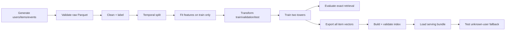
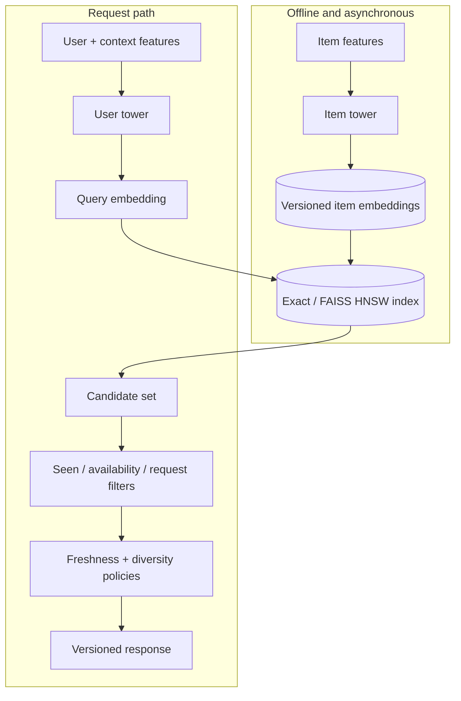
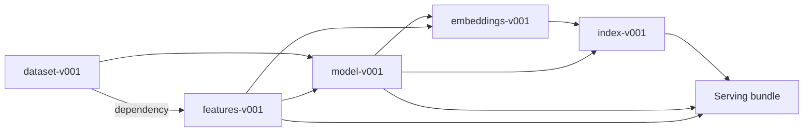

# Two-Tower Recommender

An executable, production-oriented reference implementation of neural candidate retrieval. The
repository covers the full lifecycle from biased behavioral events to a versioned two-tower model,
item embeddings, exact or FAISS HNSW search, policy-aware recommendations, batch outputs, and a
FastAPI service with operational controls.

> This project implements **candidate retrieval**. It does not claim that vector similarity replaces
> a production ranking stack. A mature system normally follows retrieval with richer ranking,
> business-policy enforcement, calibrated exploration, and online experimentation.

## What you can run

The default workflow needs Python 3.12 and [`uv`](https://docs.astral.sh/uv/). It does not require a
GPU, cloud account, private dataset, Redis, PostgreSQL, or a paid vector database.

```bash
make setup
make demo
```

`make demo` deterministically performs this complete sequence:



Expected success is a final JSON object containing `"pipeline": "complete"`. Metric values are not
hard-coded because they can differ slightly across compatible CPU architectures and math kernels.

## Why this architecture

Recommendation at large catalog sizes is a staged search problem. Scoring every item with an
expensive model on every request is usually infeasible. Two towers move item computation offline:



The towers learn vectors in a shared space. For normalized embeddings, inner product equals cosine
similarity. In-batch softmax increases the probability of observed user-item pairs relative to
other items in the batch. At serving time, only the user tower and nearest-neighbor lookup are on
the critical path.

## Implemented boundaries

| Boundary | Concrete implementation | Production invariant |
|---|---|---|
| Data | Synthetic biased events, schema checks, deterministic cleanup, Parquet | Invalid records are reported; time never flows backward across splits |
| Features | Train-fitted vocabularies and z-score statistics | Serving loads the same checksummed processor used by training |
| Model | Native PyTorch independent user/item towers | Both towers emit the configured shared dimension |
| Loss | Multi-positive in-batch softmax / InfoNCE | Duplicate item positives are not treated as ordinary negatives |
| Sampling | In-batch, uniform, popularity, ANN hard-sampler components | Known positives are excluded when avoidable; seeded behavior is repeatable |
| Training | CPU/CUDA, deterministic mode, AMP on CUDA, clipping, schedulers, early stop | Best and final weights plus metadata and model card are published |
| Evaluation | Exact top-K retrieval, ranking/coverage/bias/diversity/segment metrics | Seen training items are excluded from candidate results |
| Search | Exact oracle and optional FAISS HNSW | Model, embedding, metric, and dimension compatibility are verified |
| Online | FastAPI, timeouts, request limits, correlation IDs, Prometheus | Unknown users receive eligible fallback results rather than an empty list |
| Batch | Chunked Parquet input/output with manifests | Outputs are versioned and restartable by completed-part discovery |
| Security | Safe tensor loading, checksums, path containment, non-root image | Untrusted pickle and unchecked artifact replacement are not accepted |
| Operations | Compose, Kubernetes, CI, runbooks, readiness | A process is ready only after a compatible immutable bundle loads |

## Repository map

```text
.
├── configs/                   # Strict YAML profiles
├── deploy/
│   ├── kubernetes/            # Deployment, probes, HPA, PDB, network policy, PVC
│   ├── prometheus/            # Local scrape configuration
│   └── grafana/               # Datasource provisioning
├── docs/                      # Theory, contracts, deployment, operations, runbooks
├── src/recommender/
│   ├── data/                  # Generation, validation, labels, temporal splits
│   ├── features/              # Train-fitted transformation artifact
│   ├── models/                # User tower, item tower, retrieval loss
│   ├── sampling/              # Pluggable negative samplers
│   ├── training/              # Datasets, batching, native PyTorch trainer
│   ├── evaluation/            # Exact metrics, baselines, segments, reports
│   ├── embeddings/            # Offline item encoding
│   ├── indexing/              # Exact and FAISS HNSW implementations
│   ├── retrieval/             # Immutable runtime bundle and fallbacks
│   ├── reranking/             # Filtering, freshness and diversity policies
│   ├── serving/               # FastAPI schemas and endpoints
│   ├── batch/                 # Restartable offline recommendation job
│   ├── artifacts/             # Manifests, checksums, compatibility
│   └── monitoring/            # Offline distribution comparison
└── tests/                     # Unit through end-to-end, security and concurrency
```

## Lifecycle commands

Every documented command maps to the Typer application in `src/recommender/cli.py`.

```bash
# Data and features
uv run recommender generate-data --config configs/demo.yaml
uv run recommender validate-data --config configs/demo.yaml
uv run recommender prepare-data --config configs/demo.yaml

# Model lifecycle
uv run recommender train --config configs/demo.yaml
uv run recommender export-item-embeddings --config configs/demo.yaml
uv run recommender evaluate --config configs/demo.yaml
uv run recommender build-index --config configs/demo.yaml
uv run recommender validate-index --config configs/demo.yaml

# Runtime and inspection
uv run recommender inspect-artifact artifacts/models/model-v001 --config configs/demo.yaml
uv run recommender smoke-test --config configs/demo.yaml
uv run recommender serve --config configs/demo.yaml
```

For batch inference, supply Parquet with a `user_id` column:

```bash
uv run recommender batch-recommend \
  --input users.parquet \
  --config configs/demo.yaml
```

## API example

Start the server with `make serve`, then send a bounded request:

```bash
curl --fail-with-body http://127.0.0.1:8000/v1/recommendations \
  -H 'content-type: application/json' \
  -H 'x-request-id: local-example-001' \
  -d '{
    "user_id": "u000001",
    "top_k": 10,
    "excluded_item_ids": ["i000007"],
    "category_filter": ["books"],
    "reranking": {
      "freshness_weight": 0.1,
      "diversity_lambda": 0.8,
      "max_per_category": 3
    }
  }'
```

The response includes the request ID, retrieval score, optional final score, model/index versions,
per-stage latency, and fallback reason. It deliberately avoids raw feature values, embedding
coordinates, and sensitive internal explanations.

## Artifact lineage

Artifacts are immutable directories with a strict manifest and SHA-256 checksums:



Changing an upstream artifact requires rebuilding downstream artifacts. Startup refuses a bundle
whose declared dependencies, checksums, embedding dimension, or similarity metric disagree.

## Development quality gates

```bash
make format       # Ruff formatter
make lint         # Ruff static checks
make typecheck    # strict mypy
make test         # pytest with line and branch coverage
make security     # Bandit, detect-secrets, pip-audit
make docs         # strict MkDocs build
```

The verified suite covers configuration, temporal leakage, feature parity, samplers, tower shapes,
embedding normalization, losses, ranking metrics, manifests, FAISS/exact retrieval, API contracts,
payload limits, fallback behavior, concurrency, failure injection, and a deterministic data-to-API
pipeline. See the [testing guide](docs/testing.md) for the requirement matrix.

## Containers

Create artifacts locally, build the image, and start the API:

```bash
make demo
docker compose build api
docker compose up api
curl --fail http://127.0.0.1:8000/health/ready
```

Optional stateful and observability services are behind Compose profiles:

```bash
docker compose --profile stateful --profile observability up
```

The API image uses a multi-stage build, runs as UID/GID `10001:10001`, has a read-only root
filesystem in Compose, drops Linux capabilities, mounts artifacts read-only, and exposes an
explicit health check.

## Read the documentation by role

| If you are… | Start here | Then read |
|---|---|---|
| New to recommenders | [Recommendation concepts](docs/recommendation-concepts.md) | [Two-tower theory](docs/two-tower-theory.md) |
| ML engineer | [Feature engineering](docs/feature-engineering.md) | [Training](docs/training.md), [Evaluation](docs/evaluation.md) |
| Data engineer | [Data pipeline](docs/data-pipeline.md) | [Artifacts](docs/artifacts.md), [Monitoring](docs/monitoring.md) |
| Backend engineer | [Serving](docs/serving.md) | [Vector search](docs/vector-search.md), [Batch inference](docs/batch-inference.md) |
| Platform/SRE | [Deployment](docs/deployment.md) | [Observability](docs/observability.md), [Operations](docs/operations.md) |
| Security reviewer | [Security and threat model](docs/security.md) | [Artifacts](docs/artifacts.md), [Limitations](docs/limitations.md) |

## Honest production boundary

Before serving real traffic, replace synthetic sources with governed data contracts; calibrate
labels against delayed outcomes; validate HNSW recall and memory on the real catalog; add an
identity-aware authorization layer, edge rate limiting, TLS, and signed artifact promotion;
implement deletion and retention SLAs; introduce a learned downstream ranker; and run guarded
online experiments. Offline metrics demonstrate pipeline behavior, not causal business lift,
fairness, or long-term feedback-loop safety.
