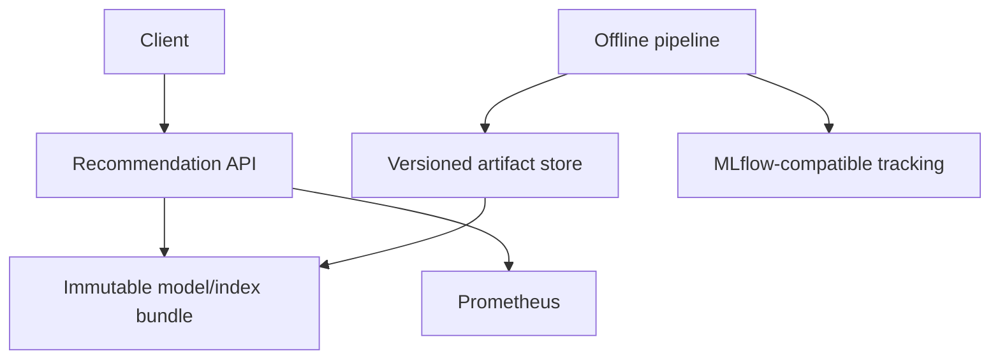
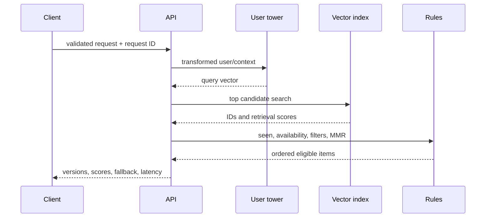

# Architecture

## Context and containers

Model, feature, embedding, and index manifests form an explicit compatibility graph. Runtime
startup verifies checksums and dependency versions before readiness. Loaded tensors and indexes
are read-only during requests. Blue-green deployments load a second complete bundle, validate it,
then atomically replace the process reference; in-flight requests retain the old bundle.

Failure boundaries: invalid data is reported and quarantined; a corrupt artifact blocks
publication/readiness; unknown identities use fallbacks; cache failure should bypass cache;
candidate exhaustion invokes an eligible fallback. A separate worker or deployment is recommended
for batch inference so it cannot starve online serving.
