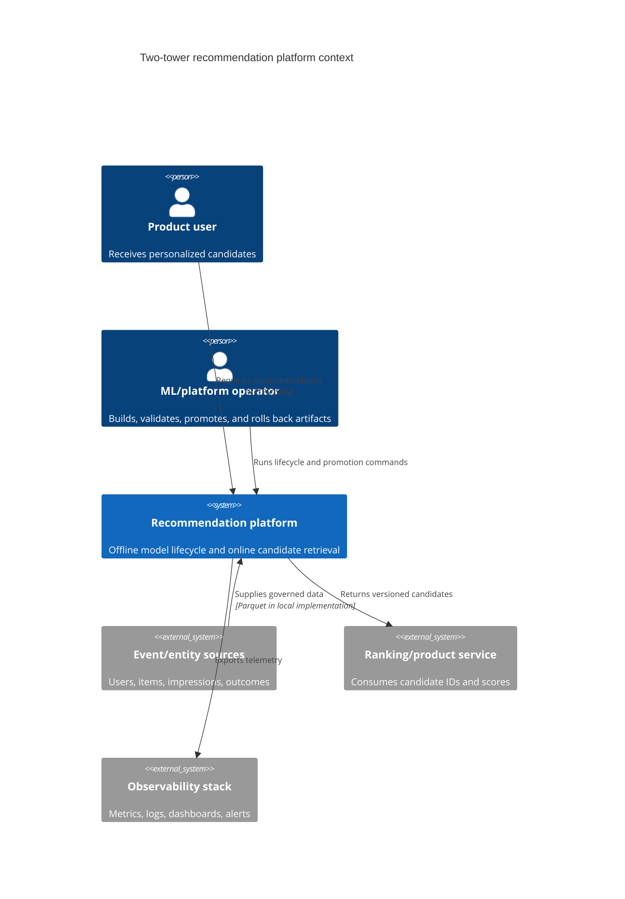
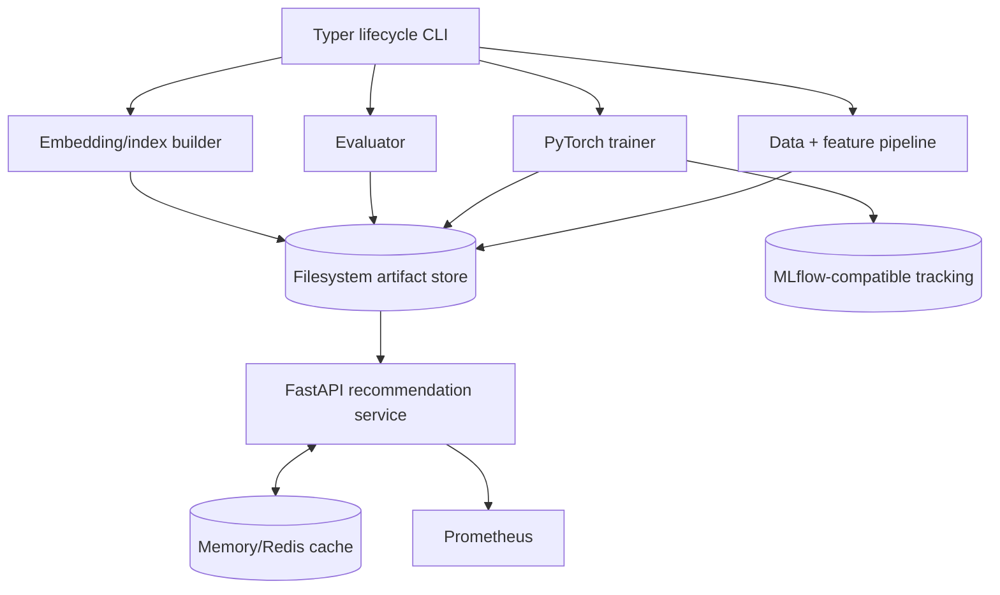
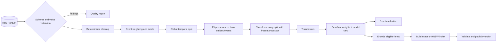
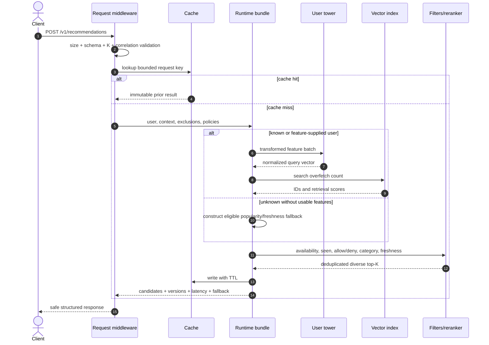
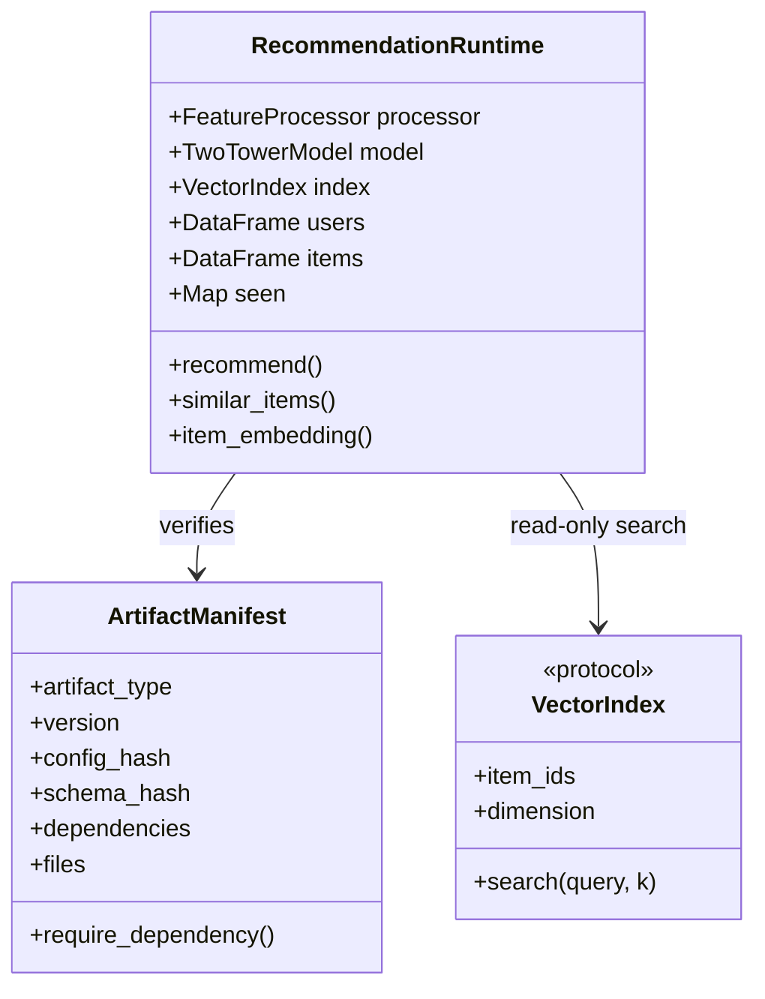
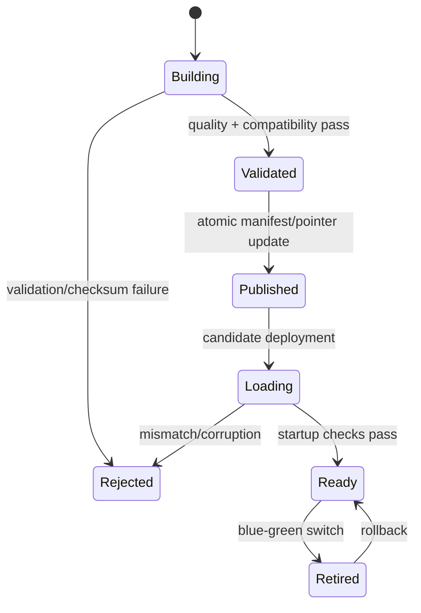
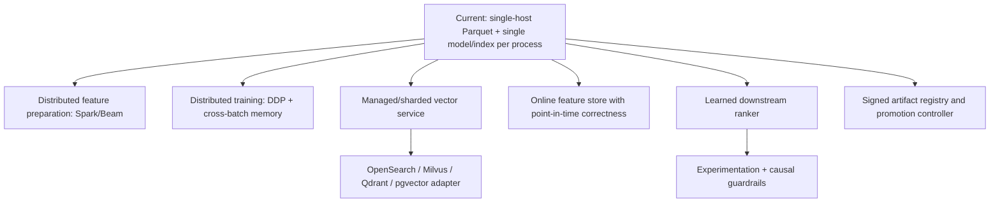

# Architecture

The system separates offline mutation from online read-only serving. Offline jobs create immutable,
checksummed artifacts. Serving loads one compatible bundle and does not mutate model weights,
feature vocabularies, embeddings, or index state during requests.

## Context

## Containers and ownership

| Container | Package ownership | Writes durable state? | Scaling model |
|---|---|---:|---|
| Lifecycle CLI | `recommender.cli` | Yes, through pipelines | Job/process per invocation |
| Data pipeline | `data`, `features` | Dataset and processor artifacts | Single-host local; distributed adapter extension |
| Trainer | `models`, `training`, `sampling` | Checkpoints, card, tracking metadata | CPU/single GPU implementation |
| Evaluator | `evaluation` | JSON/CSV/Markdown reports | Offline batch |
| Index builder | `embeddings`, `indexing` | Vectors and index artifacts | Offline batch |
| Online API | `serving`, `retrieval`, `reranking` | No model/index mutation | Replicated immutable processes |
| Control boundaries | `artifacts`, `security`, `monitoring` | Manifests/reports | Shared libraries |

## Offline data and model flow

### Leakage boundary

The processor fits vocabularies and numerical statistics only from users/items observed in the
training event window. Validation and test transformations can map unseen categories to `<UNK>`,
but cannot expand the vocabulary or alter statistics. The model never trains on test positives.

## Online request flow

## Runtime bundle and compatibility

Startup loads and verifies feature, model, embedding, and index manifests before declaring
readiness. Files are checksummed before use. Model state is loaded with PyTorch `weights_only=True`.
String item IDs are fixed-width NumPy Unicode arrays and loaded with pickle disabled.

## Artifact state machine

Publication is downstream-only: a model cannot silently consume a different feature processor, and
an index cannot silently serve vectors from another model version.

## Failure boundaries

| Failure | Containment behavior | User-visible effect |
|---|---|---|
| Malformed raw data | Finding report and deterministic exclusion | Offline job may fail in strict mode |
| Empty cleaned dataset | Typed `DataQualityError` | No artifact published |
| Corrupt artifact | Checksum/manifest exception | Readiness remains false |
| Model-index mismatch | Dependency/metric/dimension rejection | Deployment does not enter service |
| Unknown user | Cold-feature encoding or fallback pool | Non-empty response when eligible items exist |
| Unknown item | Typed similar-item fallback reason | Safe response, no stack trace |
| Cache unavailable | Adapter boundary permits bypass policy | Higher latency, core retrieval remains possible |
| Over-filtering | Eligible fallback attempt | Fallback metadata or bounded short result |
| Request timeout | Safe structured error | No internal exception details |

## Scaling roadmap

These are explicit extensions, not hidden dependencies of the local workflow.

