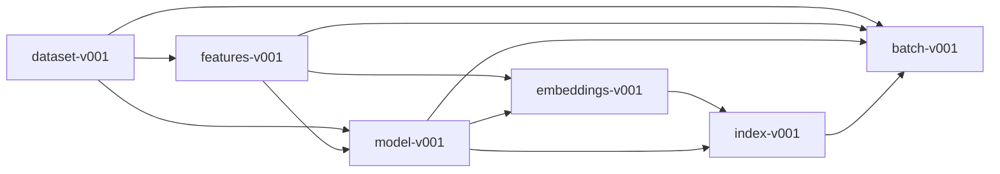
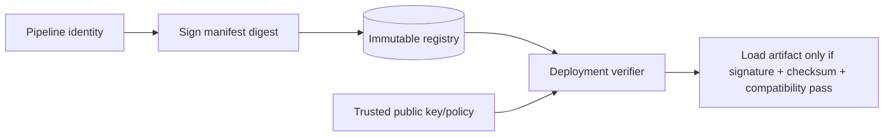
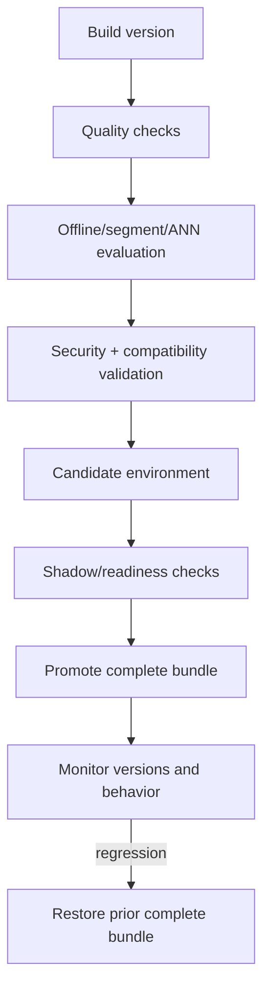

# Artifact lineage, integrity, and promotion

Every durable pipeline output is an immutable version directory with a strict manifest. Artifacts
are contracts between independently running jobs; filenames alone are not sufficient compatibility.

## Lineage graph



Downstream artifacts declare upstream name/version dependencies. A consumer calls
`require_dependency` before use and receives a typed compatibility error on mismatch.

## Manifest schema

| Field | Purpose |
|---|---|
| `artifact_type` | Closed type: dataset, features, model, embeddings, index, batch |
| `version` | Validated lowercase version identifier |
| `created_at` | UTC creation timestamp |
| `config_hash` | Canonical hash of relevant configuration |
| `schema_hash` | Canonical hash of schema/vocabulary/shape contract |
| `dependencies` | Upstream artifact versions |
| `files` | Relative file path to SHA-256 checksum |
| `metadata` | Type-specific counts, metrics, dimensions, or environment information |

Unknown manifest fields are rejected. On load, every declared file must exist and match its
checksum. Paths are relative to the artifact directory, and CLI inspection confines requested paths
to the configured artifact root.

## Integrity is not authenticity

SHA-256 checksums detect accidental or post-manifest modification. They do not prove who created the
manifest: an attacker able to replace both payload and manifest can recompute checksums. Production
promotion should add signature verification or a trusted registry/object-store identity policy.



Signature verification is a documented production extension, not an implemented claim.

## Atomic publication

Payload files are written first. The manifest is calculated after payload completion and written
atomically through a temporary file and `os.replace`. JSON artifacts are mode `0644` so the non-root
container can read host-built manifests; directory and mount permissions remain deployment controls.

Readers should treat manifest presence as publication completion. Never mutate payload files under a
published version.

## Compatibility matrix

| Consumer | Required validation |
|---|---|
| Feature transform | Dataset dependency and processor checksum |
| Model loader | Feature version and vocabulary-derived table shapes |
| Embedding export | Model and feature versions; shared embedding dimension |
| Index loader | Model dependency, embedding version, metric, dimension, ID alignment |
| Serving runtime | Complete feature/model/index chain plus readable entity/policy metadata |
| Batch job | Same runtime bundle plus input/output contract and job version |

## Safe loading

The project avoids general untrusted pickle loading:

- model state dictionaries use `torch.load(..., weights_only=True)`;
- processor and manifests are strict JSON/Pydantic;
- embeddings are numeric `.npy` with pickle disabled;
- item IDs are fixed-width Unicode `.npy` with pickle disabled;
- FAISS files are loaded only after manifest checksum verification.

Artifact roots still require filesystem isolation and write authorization.

## Promotion and rollback



Rollback changes the entire compatible bundle, not only the index or model. Retain at least one
known-good bundle and its configuration for the rollback window.

## Inspection

```bash
uv run recommender inspect-artifact artifacts/datasets/dataset-v001 --config configs/demo.yaml
uv run recommender inspect-artifact artifacts/feature-pipelines/features-v001 --config configs/demo.yaml
uv run recommender inspect-artifact artifacts/models/model-v001 --config configs/demo.yaml
uv run recommender inspect-artifact artifacts/indexes/index-v001 --config configs/demo.yaml
```

Inspection verifies checksums before printing the manifest. A mismatch is a deployment-blocking
error, not a warning to bypass.

