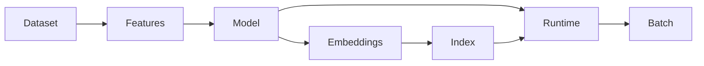

# Artifact lifecycle

Artifacts are immutable directories under `datasets`, `feature-pipelines`, `models`, `embeddings`,
`indexes`, and `batch-recommendations`. Every manifest has type, version, creation time, canonical
configuration and schema hashes, dependency versions, metadata, and SHA-256 checksums.

Checksums protect accidental corruption and support tamper detection only when the manifest itself
comes from a trusted, authenticated registry. Production promotion should sign manifests, restrict
write identity, retain an audit log, and fetch over authenticated transport. State dictionaries are
loaded only after checksum verification with `weights_only=True`; NumPy arrays disable pickle.
