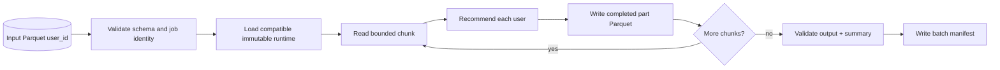
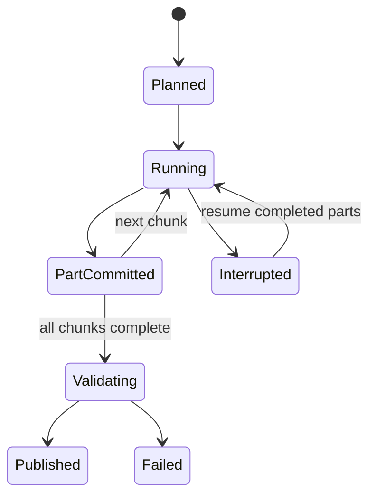

# Batch recommendation inference

Batch inference generates versioned recommendations for a Parquet population without loading every
user into memory. It uses the same feature processor, model, index, filters, and fallback semantics
as online serving.

## Flow



## Input and output contracts

Input requires a `user_id` column. Production adapters can include permitted feature overrides and
segment columns, but should reject unexpected sensitive data rather than carrying it through.

Output records the user, ordered recommendation IDs/scores, fallback state, model/index versions,
and job metadata in a versioned directory. A manifest checksums completed parts and declares runtime
dependencies.

## Memory and throughput

Chunk size bounds DataFrame and response memory. The model and index load once per worker/job, while
users stream through chunks. Larger chunks improve vectorization opportunities but increase retry
cost and memory. The current implementation prioritizes bounded correctness; high-throughput
production work should batch user-tower tensors and vector queries rather than invoking one user at
a time.

## Restartability

Completed part files are durable checkpoints. On restart, the job can discover valid existing parts
and continue at the next chunk. A part is complete only after its atomic write succeeds. Final
publication occurs after output validation and manifest creation.



Idempotency requires a stable input fingerprint, runtime bundle versions, configuration hash, and
output version. Reusing an output version with different inputs should fail rather than mix parts.

## Determinism

With an immutable runtime, stable input order, deterministic policies, and no time-dependent feature
default, results are reproducible. Rebuilding an approximate index with different insertion order or
changing hardware/library versions can alter tied ANN ordering; record versions and define tie
tolerance.

## Isolation from online traffic

Run batch jobs in a separate process/deployment so they cannot consume online API CPU, memory,
index-search capacity, or cache. In Kubernetes, use a Job/CronJob with independent resources and the
same read-only bundle delivery mechanism.

## Command

```bash
uv run recommender batch-recommend \
  --input users.parquet \
  --config configs/demo.yaml
```

Success requires a checksummed manifest, non-empty valid parts for non-empty input, bounded list
lengths, known model/index versions, no duplicate items within a user list, and summary counts that
match written rows.

