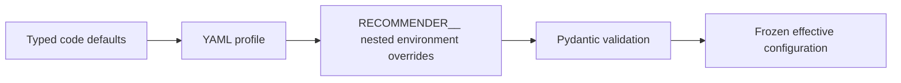
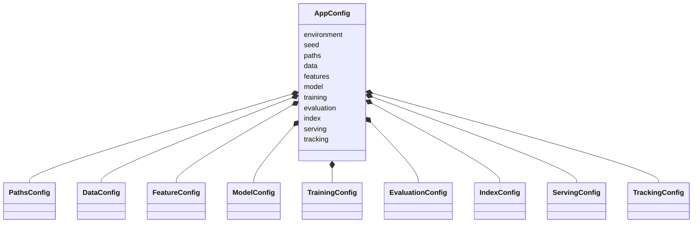
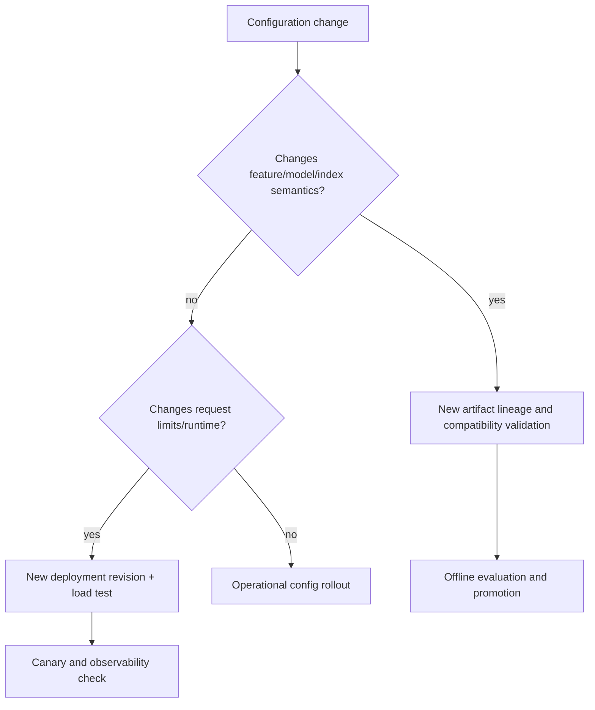

# Configuration management

Configuration is a strict, immutable Pydantic v2 hierarchy loaded from YAML and optionally
overridden by environment variables. Unknown fields fail rather than being ignored.

## Precedence



Later layers win. Environment keys use double underscores for nesting, for example:

```bash
export RECOMMENDER__ENVIRONMENT=production
export RECOMMENDER__SERVING__PORT=8080
export RECOMMENDER__SERVING__MAX_K=50
export RECOMMENDER__TRACKING__URI=https://mlflow.internal.example
uv run recommender serve --config configs/production.yaml
```

Do not place secrets in YAML. The current schema contains service configuration but no committed
credential fields. External adapters should receive credentials through the deployment secret
manager and redact them from any effective-configuration display.

## Hierarchy and validation



### Cross-field rules

- `train_fraction + validation_fraction < 1`, preserving a non-empty test fraction;
- evaluation K values are unique positive integers;
- serving `default_k <= max_k`;
- model similarity equals index metric;
- dimensions, rates, dropout, temperature, HNSW parameters, ports, and limits satisfy bounded fields.

### Key sections

| Section | Controls | Compatibility consequence |
|---|---|---|
| `paths` | raw/artifact/report roots | Deployment and containment boundary |
| `data` | size, invalid/duplicate rates, positive labels, split fractions | Dataset/config fingerprint |
| `features` | minimum frequency, history width | Vocabulary and tensor schema |
| `model` | dimensions, hidden layers, activation, dropout, metric, temperature | Weight shapes and index semantics |
| `training` | optimizer controls, scheduler, determinism, resume | Training behavior/metadata |
| `evaluation` | K values, bootstrap samples | Report comparability |
| `index` | backend, metric, HNSW parameters, over-fetch | Index compatibility and latency |
| `serving` | host/port, K/batch/timeout/CORS limits | API work and exposure boundary |
| `tracking` | enabled, URI, experiment | Explicit external side effect |

## Profiles

`configs/demo.yaml` is CPU-friendly and exact-search oriented. `configs/production.yaml` selects
production environment behavior, FAISS, bounded API defaults, and an explicit tracking endpoint.
Profiles are examples, not capacity recommendations.

Do not create inheritance through undocumented YAML anchors or shell preprocessing. Prefer complete,
reviewable profiles plus explicit environment overrides.

## Effective configuration and redaction

Operational tooling should render the validated model with known secret fields replaced by
`<redacted>`, and should hash the non-secret canonical configuration into artifact manifests. Never
log environment variables wholesale; they frequently contain platform credentials unrelated to the
application.

## Change classification



Examples: changing `embedding_dim`, vocabulary frequency, temperature, or metric requires rebuilt
downstream artifacts. Changing the serving port requires deployment validation but not retraining.

## Failure examples

```text
index.metric=dot + model.similarity=cosine
=> validation error before index or service startup

serving.default_k=100 + serving.max_k=50
=> validation error before request handling

unknown YAML key model.embeding_dim
=> extra-forbidden error instead of silently using the default
```

Use `uv run recommender COMMAND --help` for command-specific configuration entry points. Tests cover
unknown keys, nested overrides, missing/invalid YAML, split rules, limit rules, and metric mismatch.

