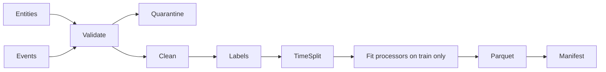

# Data pipeline

`generate-data` writes user, item, and event Parquet tables. Events carry identity, event type,
UTC timestamp, session, position, device, dwell time, and optional rating. `validate-data` reports
schema failures, null keys, invalid event types/timestamps/positions, unknown entities, and
duplicates. Preparation deterministically quarantines invalid rows and keeps the latest record for
a duplicate event ID.

Event weights are impression 0, click 1, view 1.2, cart 2.5, purchase 4, and rating 1.5. The
positive threshold and allowed event types are configurable. Repeated interactions remain separate
training observations; serving exclusion collapses them to a set. Session IDs use half-hour
synthetic boundaries. A production late-event policy should watermark source partitions, rebuild
affected immutable dataset versions, and never mutate an already promoted version.

User deletion requires removal from source, training data, derived histories, cache, batch output,
and future artifact versions. Existing models may retain aggregate influence; deletion policy must
define whether expedited retraining is required. Unavailable/deleted items are excluded from export
and serving, with tombstones required for incremental external indexes.
