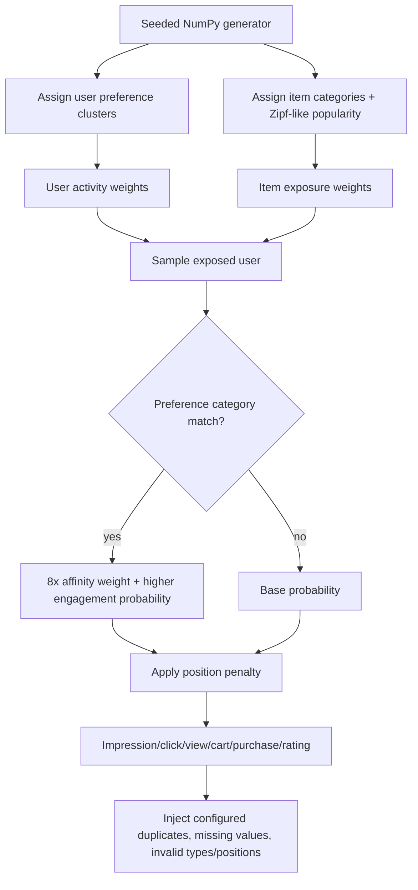
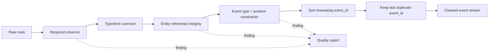
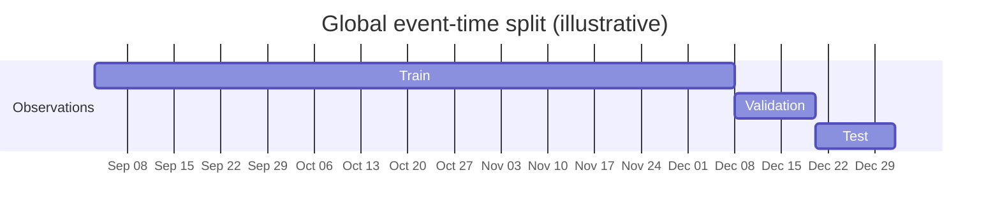
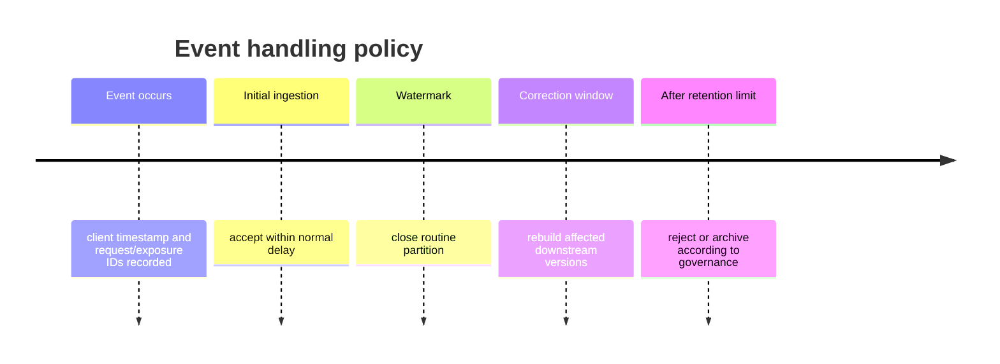

# Data pipeline

The data pipeline turns entity snapshots and biased behavioral events into deterministic,
point-in-time splits. Its most important property is not throughput; it is preserving event-time
semantics so future information cannot influence earlier predictions.

## Input contracts

### Users

| Field | Type/meaning | Model use | Missing policy |
|---|---|---|---|
| `user_id` | Stable pseudonymous identity | ID embedding and joins | Required |
| `age_bucket` | Coarse categorical age range | Categorical embedding | Unknown token |
| `country` | Coarse geography | Segment and embedding | Unknown token |
| `language` | Preferred language | Embedding | Synthetic data injects missing values |
| `subscription_tier` | `free`, `standard`, `premium` | Embedding and evaluation segment | Unknown token |
| `device_preference` | Dominant device | User feature | Unknown token |
| `account_age_days` | Non-negative duration | Standardized numerical feature | Training mean |
| `preferred_categories` | Pipe-separated multi-value categories | Padded preference embeddings | Empty/padding |
| `activity_score` | Synthetic activity propensity | Standardized feature and activity segment | Training mean |

### Items

| Field | Meaning | Runtime role |
|---|---|---|
| `item_id` | Stable candidate identity | ID embedding, index ID, response ID |
| `category`, `subcategory` | Taxonomy | Embeddings, filtering, diversity |
| `language`, `brand`, `price_bucket` | Content categories | Embeddings and cold-start information |
| `price`, `popularity`, `freshness_days` | Numerical state | Standardized tower features; policy metadata |
| `title` | Text metadata | Persisted but not encoded by the current tower |
| `available` | Eligibility state | Hard serving filter |
| `created_at` | Creation time | Data lineage and future extension |

### Interactions

| Field | Purpose |
|---|---|
| `event_id` | Deduplication key |
| `user_id`, `item_id` | Entity joins |
| `event_type` | Impression or weighted engagement label source |
| `timestamp` | UTC event time and split ordering |
| `session_id` | Thirty-minute synthetic session identity |
| `position` | Exposure position and context feature |
| `device` | Request context |
| `dwell_seconds`, `rating` | Persisted outcome context; not all are tower inputs |

## Synthetic behavior model

The generator is deterministic for a fixed seed. It deliberately creates learnable signal and
realistic failure fixtures rather than independent random rows.



Long-tail popularity follows approximately \(p(r)\propto r^{-1.15}\). User activity is also
heavy-tailed. The last 10% of users and items enter only after 85% of event time, creating temporal
cold-start cohorts. Matching preference clusters increase item sampling affinity and positive
probability. Position reduces engagement probability, creating observable position bias.

## Validation and cleanup



The cleanup policy accepts only rows with non-null known user/item IDs, supported event types,
positive positions, and parseable UTC timestamps. It sorts deterministically and keeps the final
row for a repeated `event_id`. Validation findings are persisted in dataset metadata; strict CLI
mode fails on error-severity findings instead of silently ignoring them.

## Labels and repeated behavior

The event-weight map distinguishes exposure from engagement. A label is positive only when:

```text
event_type is configured as positive
AND event_weight >= positive_weight_threshold
```

Multiple valid user-item interactions remain separate temporal examples. This preserves repeated
engagement evidence and context differences. Deduplication is by event identity, not by user-item
pair. The current retrieval loss does not consume continuous event weights; thresholding constructs
binary positives. Weight-aware objectives are an extension.

## Time-based splitting

Events are globally ordered by `(timestamp, event_id)`, then cut into train, validation, and test.



The following invariant is tested:

\[
\max(t_{train}) \le \min(t_{validation}) \le \max(t_{validation}) \le \min(t_{test}).
\]

Random splitting would place later behavior for the same identity in training while evaluating an
earlier event. It would also leak future item popularity and category availability patterns.

## Dataset layout and manifest

```text
artifacts/datasets/dataset-v001/
├── users.parquet
├── items.parquet
├── train.parquet
├── validation.parquet
├── test.parquet
├── manifest.json
└── transformed/
    ├── users.parquet
    ├── items.parquet
    ├── train.parquet
    ├── validation.parquet
    └── test.parquet
```

The manifest records version, creation time, configuration hash, schema hash, checksums, row and
positive counts, split boundaries, random seed, and quality findings. A content checksum catches
post-publication modification.

## Late events, deletion, and availability

The local implementation rebuilds immutable datasets. Production ingestion should define a
watermark and correction window:



User deletion requires removal from governed source tables, future training snapshots, batch
outputs, caches, and any identity-indexed repository. Because learned weights may retain aggregate
influence, high-assurance deletion can require retraining from a compliant snapshot. Deleted or
unavailable items must be excluded at runtime immediately; a later full embedding/index rebuild
removes them physically.

## Commands and verification

```bash
uv run recommender generate-data --config configs/demo.yaml
uv run recommender validate-data --config configs/demo.yaml
uv run recommender validate-data --strict --config configs/demo.yaml
uv run recommender prepare-data --config configs/demo.yaml
uv run recommender inspect-artifact artifacts/datasets/dataset-v001 --config configs/demo.yaml
```

Success means Parquet files exist, the report describes the intentionally injected malformed rows,
cleaned splits contain valid foreign keys, split boundaries are monotonic, and the manifest verifies.

