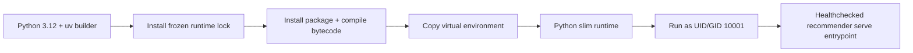
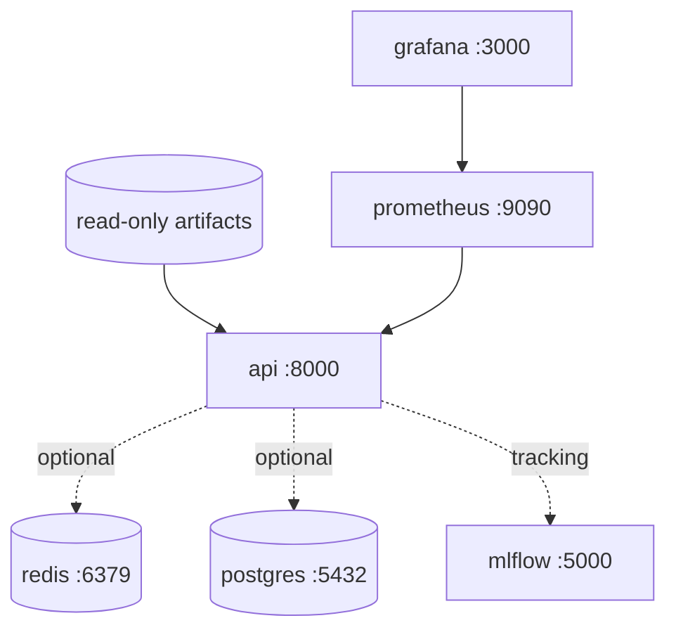
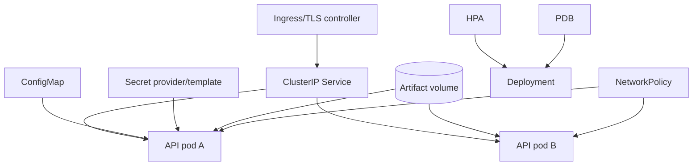
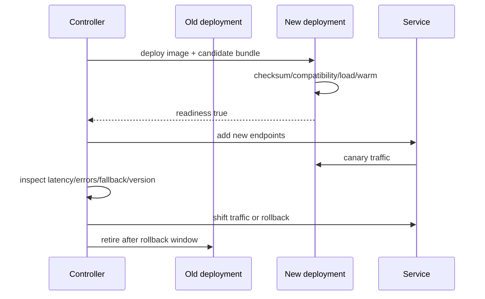

# Deployment

Deployment packages an immutable service and delivers a compatible model/index bundle. The API must
not become ready until the entire bundle validates.

## Container build



The multi-stage Dockerfile leaves development tools out of the runtime dependency set. It uses the
official CPU PyTorch wheel source for the default image, an explicit init process in Compose for
signal handling, a non-root identity, and no embedded artifacts or credentials.

```bash
docker build -t two-tower-recommender:local .
docker image inspect two-tower-recommender:local
```

## Local Compose topology



The API runs alone by default. Stateful and observability services use profiles, so optional
dependencies never block the basic workflow.

```bash
make demo
docker compose up --build api
docker compose --profile stateful --profile observability up
```

## Kubernetes resources

The manifests include namespace, service account, ConfigMap, Secret template, Deployment, Service,
startup/readiness/liveness probes, CPU/memory requests and limits, rolling update, HPA, Pod
Disruption Budget, NetworkPolicy, Ingress example, and PVC.



### Probe semantics

- startup probe gives bundle download/load/validation time without premature restarts;
- readiness removes a pod from traffic until the bundle is valid;
- liveness restarts a stuck process but should not depend on transient artifact-store availability.

### Resource planning

Each worker may hold its own PyTorch model, item metadata, embeddings, and HNSW graph. More Uvicorn
workers can multiply memory. Start with one worker per pod, measure resident memory and CPU
parallelism, then scale pods horizontally. Set limits above measured peak index load plus request
headroom to avoid OOM during rollout.

## Bundle delivery patterns

| Pattern | Benefit | Risk/use case |
|---|---|---|
| Bake into image | Single immutable deployable, easy rollback | Large rebuild/image for every model; slower registry transfer |
| Init container download | App image independent of model; validate before startup | Startup depends on object store; needs atomic local staging |
| Sidecar synchronization | Background download and prewarming | Coordination complexity; never mutate active files in place |
| Mounted read-only volume | Efficient shared delivery | Version/pointer governance and multi-zone storage semantics |

The provided manifests demonstrate mounted artifacts. Production should select one pattern and
enforce complete bundle versioning.

## Rolling and blue-green updates



Never independently roll a new model and old index when their version contract differs. Roll the
complete bundle.

## CI/CD boundary

PR workflows install from lock, format/lint/typecheck, run tests/coverage/security/docs, build the
image, smoke the container, and verify artifact compatibility. Scheduled/extended workflows run
slower checks. Deployment is intentionally a credential-free template: configure environment
protection, OIDC, signed images, approved registries, and required secrets in the owning platform.

## Deployment verification

```bash
kubectl apply --dry-run=server -f deploy/kubernetes/
kubectl rollout status deployment/recommender -n recommender
kubectl get pods -n recommender
curl --fail https://RECOMMENDER_HOST/health/ready
curl --fail https://RECOMMENDER_HOST/version
```

Do not run the live-cluster commands without a configured target and reviewed Secret/Ingress values.

