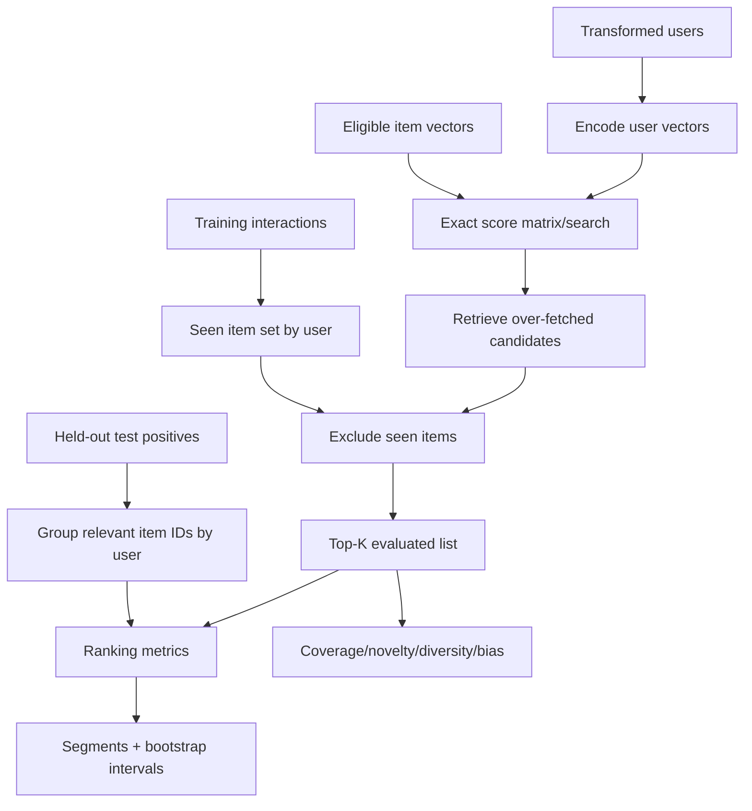
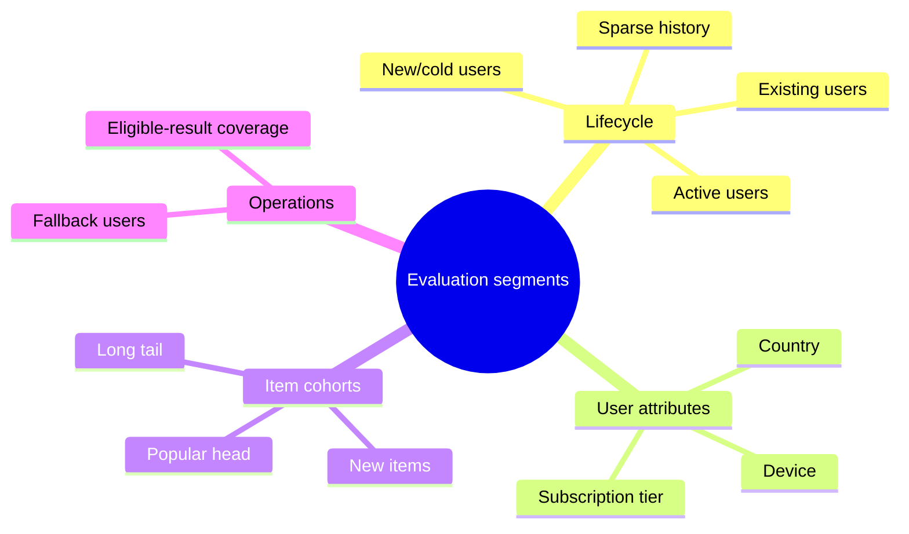

# Offline evaluation

Offline evaluation reconstructs a retrieval decision for users with held-out positive interactions.
It is a correctness and selection tool, not evidence of causal product impact.

## Evaluation protocol



Training-seen items are removed before top-K metrics. Test positives remain eligible. Users without
held-out positives are excluded from relevance metrics but should be counted separately for user
coverage in a broader production evaluator.

## Ranking metrics

For user \(u\), relevant set \(R_u\), and ordered recommendation list \(L_u^K\):

### Recall@K

\[
Recall@K_u=\frac{|L_u^K\cap R_u|}{|R_u|}.
\]

Recall measures how much held-out relevance retrieval recovers. It is the primary candidate-
generation metric because a downstream ranker cannot recover an item retrieval omitted.

### Precision@K

\[
Precision@K_u=\frac{|L_u^K\cap R_u|}{K}.
\]

The denominator remains \(K\) even for short lists in this implementation, making candidate
exhaustion visible rather than inflating precision.

### Hit Rate@K

\[
HR@K_u=\mathbf{1}[|L_u^K\cap R_u|>0].
\]

This is useful when any relevant result is sufficient, but ignores how many positives were found.

### Mean Reciprocal Rank

If \(r_u\) is the rank of the first relevant result:

\[
MRR@K_u=\begin{cases}1/r_u,&r_u\le K\\0,&\text{otherwise.}\end{cases}
\]

MRR strongly rewards the first hit and does not reward additional hits after it.

### NDCG@K

For binary relevance \(rel_j\):

\[
DCG@K_u=\sum_{j=1}^{K}\frac{rel_j}{\log_2(j+1)}, \qquad
NDCG@K_u=\frac{DCG@K_u}{IDCG@K_u}.
\]

NDCG rewards placing multiple relevant items near the top and normalizes for available relevant
count.

### Mean Average Precision

\[
AP@K_u=\frac{1}{\min(|R_u|,K)}
\sum_{j=1}^{K} Precision@j_u\cdot rel_j.
\]

MAP is the user mean of AP. It rewards consistent precision at every relevant position.

## Beyond relevance

| Metric | Definition/interpretation | Risk revealed |
|---|---|---|
| Catalog coverage | Unique recommended eligible items / eligible catalog | Concentration and tail starvation |
| User coverage | Users receiving usable results / evaluated users | Cold-start or filtering failure |
| Novelty proxy | Mean `-log2(popularity)` | Preference for less common items |
| Category diversity | Mean pairwise category dissimilarity | Redundant slates |
| Popularity concentration | Share or distribution of recommendations in head items | Feedback-loop amplification |
| Mean recommended popularity | Average popularity metadata | Head bias movement |
| Latency | Encode/search/evaluation wall time | Operational feasibility |

Novelty is a proxy, not surprise or satisfaction. Category diversity ignores within-category
semantic variety. Every non-relevance metric depends on metadata quality and the candidate universe.

## Segment evaluation

Global averages can improve while important cohorts regress. Reports break results down by
available user attributes and behavioral lifecycle:



Small segments have high variance. Always report sample counts and confidence intervals; do not
compare point estimates without uncertainty.

## Bootstrap confidence intervals

The evaluator resamples users with replacement using the configured seed. For metric \(m\), the
percentile interval is derived from the bootstrap distribution of user-level means. User-level
resampling retains correlation among a user's relevant items better than resampling individual
recommendations.

Zero bootstrap samples disables intervals for fast tests. Production comparisons should choose
enough samples for stable tails and record the random seed.

## Baselines

At minimum compare neural retrieval to eligible popularity. Other useful baselines include random
eligible selection, recent popularity, category popularity, and previous production model. A model
that cannot beat a robust popularity baseline by meaningful cohorts should not advance because of
one favorable aggregate metric.

## Exact versus ANN evaluation

Exact search is the correctness oracle. ANN quality is measured independently:

\[
ANNRecall@K=\frac{|ANN_K(q)\cap Exact_K(q)|}{K}.
\]

Model Recall@K and ANNRecall@K answer different questions. The former measures learned relevance;
the latter measures how faithfully the index approximates model scores. Always report ANN latency,
index parameters, memory, and corpus size alongside ANN recall.

The local evaluator uses exact retrieval. Index validation checks persistence and self-retrieval;
representative ANN-versus-exact benchmarking is a required production capacity exercise.

## Report outputs

The evaluation job emits machine-readable JSON and CSV plus Markdown for review. Reports include
configuration/version context, global metrics, segments, baseline results, coverage/bias measures,
latency, and optional confidence intervals. Never manually copy metrics into a model card without
preserving the report artifact and lineage.

```bash
uv run recommender evaluate --config configs/demo.yaml
```

## Offline limitations

Logged data reflects an earlier exposure policy. Metrics cannot fully correct selection, novelty,
interface, inventory, or feedback-loop effects. Advancing a model therefore requires shadow checks,
a guarded canary, randomized experimentation, guardrail metrics, and long-term monitoring.

