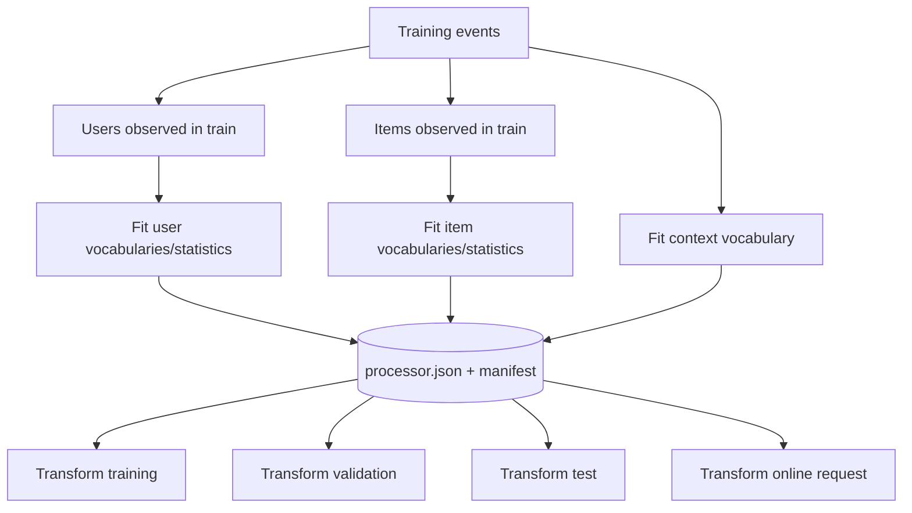
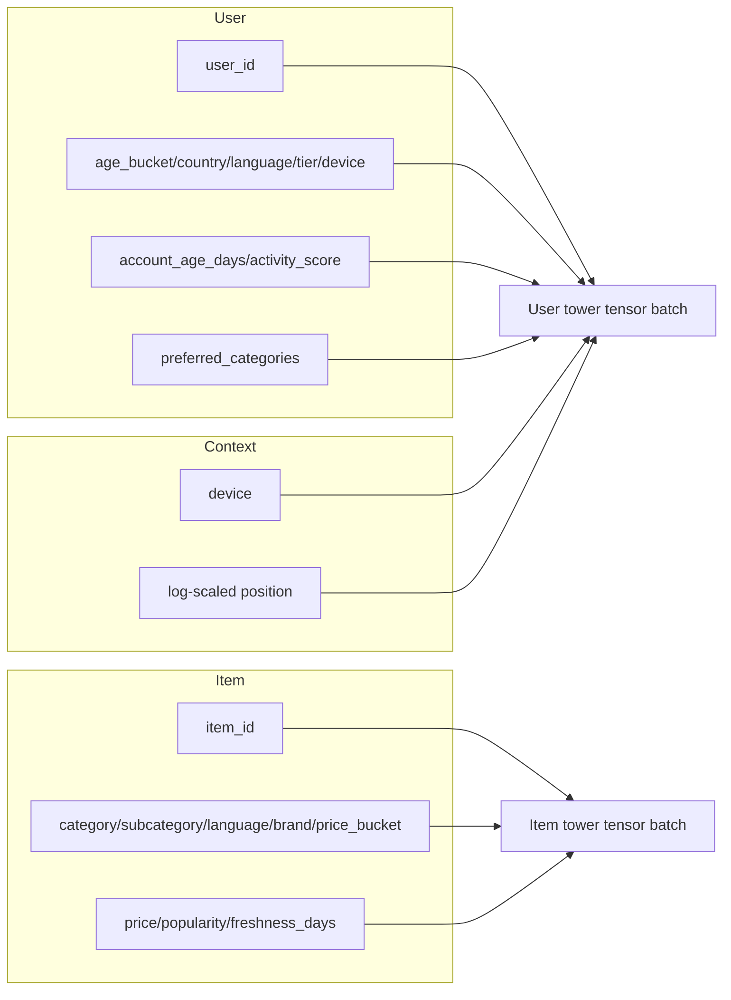
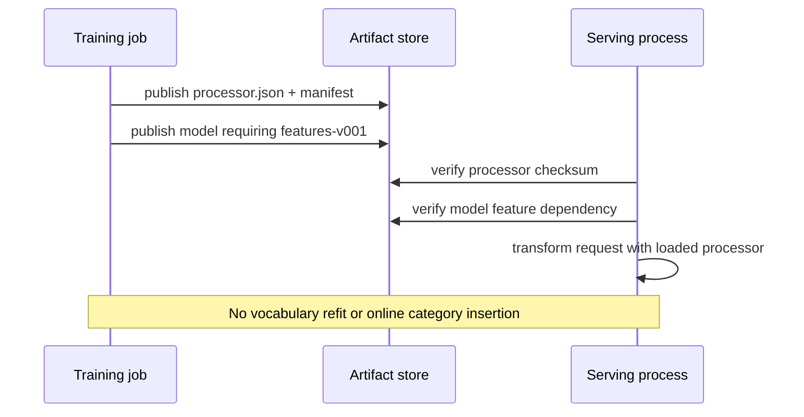

# Feature engineering and parity

The feature processor is a versioned model dependency. It owns vocabularies, missing-value behavior,
numerical statistics, multi-value padding, and the exact column contract consumed by both towers.

## Fit/transform boundary

Validation and test data never add tokens or update means and standard deviations. An unseen value
follows the same `<UNK>` path online and offline.

## Vocabulary contract

Every categorical namespace reserves:

| Index | Token | Meaning |
|---:|---|---|
| 0 | `<PAD>` | Structural absence in padded multi-value inputs; ignored by pooling |
| 1 | `<UNK>` | Missing, rare, or unseen semantic value |
| 2+ | Sorted fitted tokens | Values meeting `min_frequency` in the training population |

Sorting fitted tokens makes vocabulary construction deterministic. Special values are explicitly
excluded from the observed-token set, preventing sparse or conflicting indices. The vocabulary
size determines embedding table shape and is therefore part of the model compatibility contract.

## Feature inventory

### Numerical normalization

For training mean \(\mu_f\) and population standard deviation \(\sigma_f\):

\[
x'_f = \frac{x_f-\mu_f}{\max(\sigma_f,10^{-8})}.
\]

Missing values are imputed to the fitted mean, therefore transform to zero. This makes the missing
path stable but does not tell the model that a value was missing; explicit missing indicators would
be a useful extension when missingness carries signal.

### Multi-value preferences

Pipe-separated preferred categories are tokenized, truncated to `min(4, max_history)`, encoded, and
right-padded with zero. The tower embeds each position and pools non-padding entries. Truncation
places a hard upper bound on request work and tensor shape.

### Context position

Position is compressed as:

\[
p'=\frac{\log(1+p)}{\log(51)}.
\]

This reduces the distance between large positions while preserving ordering over the synthetic
range. Position is a contextual correlate, not a causal correction for exposure bias.

## Persisted outputs

`processor.json` contains only Pydantic-validated JSON data—no executable pickle. Its manifest
contains the feature configuration hash, vocabulary-size schema, dataset dependency, processor
contract version, and SHA-256 checksum.

Transformed entity/event tables use explicit names such as `user_country_idx`, `item_price_z`,
`context_device_idx`, and `context_position_z`. Raw IDs and policy metadata are retained where the
runtime needs them.

## Training-serving parity

Parity means that the same logical input produces the same encoded indices and normalized numbers
in training and serving. Violations are especially dangerous because the model can load and return
plausible scores while interpreting inputs incorrectly.

## Schema evolution

| Change | Compatibility | Required action |
|---|---|---|
| Add token by refitting vocabulary | Breaking for embedding table shape | New feature and model version |
| Reorder token indices | Breaking even if size unchanged | New feature/model version; never mutate in place |
| Change numerical mean/std | Semantic breaking change | New feature/model version |
| Add unused raw column | Dataset-compatible | Document and update schema hash as governed |
| Add tower input | Model architecture change | Refit processor and retrain model |
| Remove category | Map future occurrences to unknown; old embedding remains | Prefer new version during governed cleanup |

Never patch a published processor in place. Publish a new lineage and rebuild every downstream
artifact.

## Debug checklist

When training and serving disagree, inspect in order:

1. feature manifest checksum and version;
2. model `features` dependency;
3. raw field names and missing-value representation;
4. encoded index range versus embedding table size;
5. numerical means/stds and dtype;
6. multi-value ordering, truncation, and padding;
7. request context defaults.

Tests cover deterministic fitting, unknown handling, normalization, serialization, special-token
indices, and transformed train/serve behavior.

