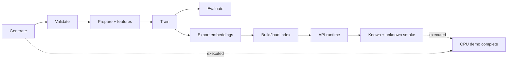
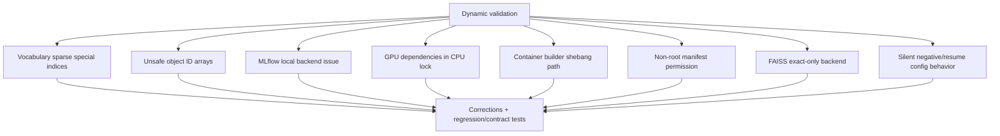
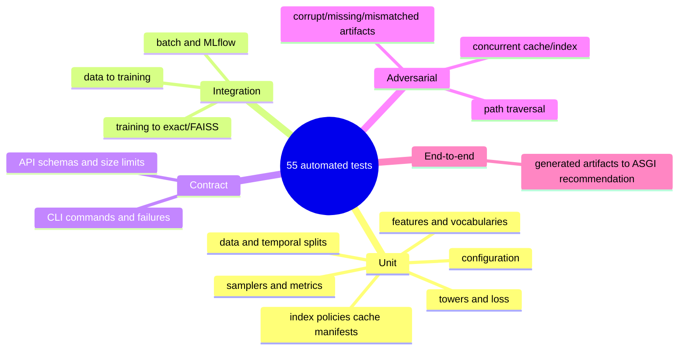
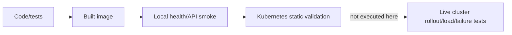

# Implementation and verification audit

This page records what was implemented, what was executed in the provided environment, what was
only statically reviewed, issues corrected during validation, and the remaining operational limits.
It is evidence, not a claim that local checks replace production qualification.

## Status vocabulary

| Status | Meaning |
|---|---|
| Implemented | Source/configuration exists in the repository |
| Executed | Command completed in the provided development environment |
| Tested | Automated assertion exercised the behavior |
| Statically reviewed | Parsed/inspected but not run against a live external platform |
| Production extension | Intentionally documented without an implementation claim |

## Lifecycle evidence



The deterministic `make demo` completed in the environment. Training loss decreased over its three
configured epochs, artifacts were exported and loaded, exact retrieval ran, and unknown-user
fallback returned candidates. Exact metric values are deliberately not presented as universal
benchmarks.

## Executed checks

| Check | Observed result |
|---|---|
| Python environment | CPython 3.12.13; frozen uv environment installed |
| Formatting | Ruff format check passed |
| Lint | Ruff checks passed |
| Static typing | Strict mypy passed for 64 source files |
| Automated tests | 55 tests passed in the final code run |
| Statement coverage | 96.28% |
| Branch coverage | 85.62% |
| Documentation | Expanded 19,000+ word site with 77 Mermaid diagrams; strict MkDocs build passed |
| Static security | Bandit and detect-secrets passed |
| Dependency audit | `pip-audit` reported no known third-party vulnerabilities at audit time |
| YAML contracts | 14 configuration/deployment YAML files parsed |
| Docker | CPU multi-stage image built from audited source |
| Container identity | UID/GID `10001:10001`; health check present |
| Container API smoke | Readiness and recommendation endpoints returned versioned success |

Vulnerability results are time-sensitive. CI and release workflows must rerun audits with current
advisory data.

## Defects found and corrected



### Vocabulary index continuity

Special tokens could produce sparse embedding indices. Padding and unknown are now reserved at 0
and 1, fitted tokens are contiguous from 2, and a regression test locks the behavior.

### Safe item identity persistence

NumPy object arrays would require pickle. Item IDs now use fixed-width Unicode arrays and all NumPy
artifact loads disable pickle.

### Tracking backend

Local tracking now uses SQLite with required SQL dependencies. Production configuration can target
the explicit Compose MLflow service.

### Dependency selection and vulnerabilities

PyArrow and pytest constraints were updated in response to audit findings. The uv source selects
official CPU PyTorch wheels by default, removing unintended CUDA packages from the local/runtime
lock.

### Container relocation and permissions

Builder/runtime paths now share `/app`, preserving virtual-environment entry-point shebangs. Atomic
JSON publication uses mode 0644 so the non-root runtime can read host-produced manifests.

### Approximate search

FAISS persistence originally used only flat exact search. The FAISS backend now uses configurable
HNSW inner-product search; exact search remains the test oracle.

### Training configuration truthfulness

Unsupported explicit sampled-training strategies now fail with a clear typed configuration error
instead of being ignored. A valid `.pt` resume path is loaded with weights-only semantics and
recorded in metadata.

## Test coverage map



Coverage excludes thin orchestration and optional protocol adapters where behavior is tested at the
boundary. The 90% statement and 85% branch targets are floors, supplemented by behavioral review.

## Deployment evidence boundary

Docker build and local container smoke were executed. Kubernetes resources were YAML-parsed and
statically reviewed; no live cluster deployment was available. Compose optional Redis/PostgreSQL/
Prometheus/Grafana topology was provided, but not every optional service integration was run as a
full production topology.



## Remaining limitations

- native training wires in-batch softmax; explicit sampler components still need a sampled-softmax
  integration and correction policy;
- checkpoint resume restores weights but not optimizer/scheduler/epoch state;
- pandas/PyArrow preparation and training are single-host/single-device implementations;
- HNSW defaults are examples, not capacity or recall recommendations;
- the policy layer is not a learned final ranker;
- Redis/PostgreSQL are optional injected adapters, not default dependencies;
- TLS, identity authorization, distributed rate limiting, manifest signing, and centralized secret
  management are platform controls;
- offline evaluation cannot establish causal lift, fairness, or long-term feedback-loop safety.

## Reproduction commands

```bash
uv sync --frozen --all-extras
make demo
uv run ruff format --check .
uv run ruff check .
uv run mypy src
uv run pytest --cov=recommender --cov-branch --cov-report=term-missing
uv run bandit -c pyproject.toml -r src
uv run detect-secrets scan --baseline .secrets.baseline
uv run pip-audit
uv run mkdocs build --strict
docker build -t two-tower-recommender:audit .
```

The dependency audit requires current network advisory access. Docker and live-platform checks
require their respective runtimes and permissions.
