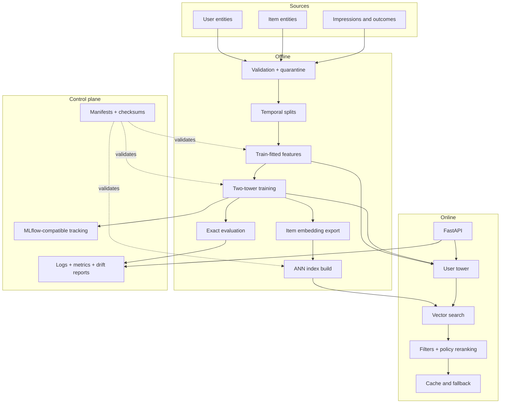

# Documentation guide

This site explains the system at four levels: recommendation theory, implementation contracts,
runtime operations, and production boundaries. It is written so a Python engineer can begin with
the concepts and progressively reach the model, data, serving, and deployment details without
assuming prior recommender-systems experience.

## System in one picture



The central design constraint is **independent encoding**. The item tower can encode the entire
catalog before requests arrive. The user tower creates a query vector online. A vector index then
returns a bounded candidate set that can be filtered and reranked cheaply.

## Learning paths

### Understand the product and model

1. [Recommendation concepts](recommendation-concepts.md) defines retrieval, ranking, feedback,
   exposure, bias, cold start, and leakage.
2. [Two-tower theory](two-tower-theory.md) derives the tower functions, similarity, temperature,
   multi-positive softmax, and computational scaling.
3. [Negative sampling](negative-sampling.md) explains why unobserved does not mean negative and how
   sampler choice changes the learned boundary.
4. [Evaluation](evaluation.md) defines every metric and why online experimentation remains needed.

### Build and modify the pipeline

1. [Architecture](architecture.md) maps components, flows, ownership, and failure boundaries.
2. [Data pipeline](data-pipeline.md) specifies event semantics, cleaning, temporal splits, and
   lineage.
3. [Feature engineering](feature-engineering.md) describes vocabularies, unknowns, normalization,
   multi-hot encoding, and training-serving parity.
4. [Training](training.md), [vector search](vector-search.md), and [artifacts](artifacts.md) cover the
   model-to-index lifecycle.

### Operate and secure the service

1. [Serving](serving.md) documents endpoint contracts, runtime initialization, filters, caching,
   fallback, and latency budgets.
2. [Observability](observability.md) and [monitoring](monitoring.md) separate request telemetry from
   model/data drift.
3. [Security](security.md) contains the trust model and threat analysis.
4. [Deployment](deployment.md), [operations](operations.md), and
   [troubleshooting](troubleshooting.md) provide deployment patterns and response procedures.

## Truth labels used in this documentation

To prevent architecture prose from becoming an accidental product claim, pages distinguish:

| Label | Meaning |
|---|---|
| **Implemented** | Code exists in this repository and is exercised by automated tests or the demo |
| **Integration point** | A stable boundary exists, but the external system is optional |
| **Production extension** | Recommended for a real deployment but deliberately not claimed as implemented |
| **Operational assumption** | A condition the deployment platform or owning team must satisfy |

Examples: exact and FAISS HNSW indexes are implemented. Redis and PostgreSQL adapters are optional
integration points. A learned downstream ranking model and causal experimentation platform are
production extensions. TLS termination and identity-aware authorization are operational
assumptions.

## Quick validation

```bash
make setup
make demo
make test
make docs
```

The authoritative record of checks executed in the development environment is the
[final audit](final-audit.md). Do not infer that a local test substitutes for workload-specific
capacity testing or a live Kubernetes rollout.

