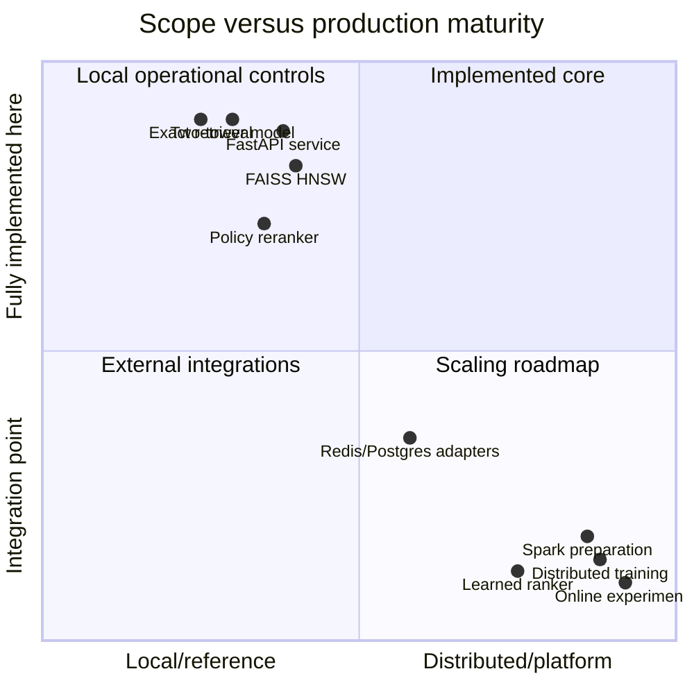
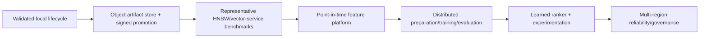

# Limitations and production extension map

This page separates deliberately implemented scope from work required for a large real deployment.
It prevents a runnable local system from being mistaken for a complete product recommendation stack.

## Capability boundary

## Current technical limitations

| Area | Current boundary | Production extension |
|---|---|---|
| Data scale | Single-host pandas/PyArrow | Spark/Beam with point-in-time joins and identical contracts |
| Data source | Synthetic deterministic generator | Governed event/entity ingestion, attribution, consent, deletion |
| Text | Title persisted but not encoded | Versioned text encoder/embedding service with parity |
| Training | CPU/single GPU native loop | DDP, distributed sampler, resumable optimizer/scheduler state |
| Negatives | In-batch wired; other samplers are components | Sampled-softmax/correction, cross-batch memory, mining refresh |
| Objective | Binary implicit retrieval | Multi-task/value-aware objectives and calibrated delayed labels |
| Evaluation | Exact local held-out evaluation | Large distributed evaluation, representative ANN recall/load |
| Index updates | Immutable rebuild | Governed incremental insertion/tombstone compaction/sharding |
| Ranker | Deterministic policy rerank | Learned cross-feature ranker and slate optimizer |
| Features | Artifact-based batch features | Online feature store with point-in-time and freshness SLAs |
| Auth/rate limit | Hook/platform guidance | Identity-aware authorization and distributed quota service |
| Artifact trust | Checksums | Signatures, provenance, immutable registry, admission policy |
| Tracing | Documented hooks | Configured OpenTelemetry SDK/collector/sampling/backend |
| Deployment proof | Manifests and local container validation | Live cluster policy, load, chaos, failover, DR validation |

## Modeling limitations

Dot-product factorization cannot represent every user-item interaction. Context is compressed into a
single user vector, so fine cross-features such as “this user prefers this brand only in this
category at this price today” are difficult. A downstream ranker is the normal solution.

In-batch negatives inherit exposure/popularity bias and can contain unlabeled positives. Synthetic
data demonstrates learnability but not real-world utility, fairness, or robustness. ID embeddings
can memorize active identities and underperform cold cohorts. Metadata can encode sensitive proxies.

## Evaluation limitations

Held-out interactions came from a biased logging policy. Offline recall can favor items the previous
system already exposed, and novelty/diversity proxies do not measure satisfaction. Confidence
intervals represent sampling uncertainty under the offline population, not policy counterfactuals.
Only guarded online experimentation measures incremental product impact.

## Operational limitations

The filesystem artifact store is appropriate for local and mounted-volume deployments, not a global
multi-region registry. In-memory cache is per process. A single process loads complete model/index
memory. Backup, disaster recovery, multi-region consistency, platform authentication, centralized
secrets, and compliance evidence belong to the deployment environment.

## Scaling sequence

Scale only after instrumenting correctness and behavior at the current stage. Moving a flawed data
contract into a distributed platform makes it faster, not safer.

