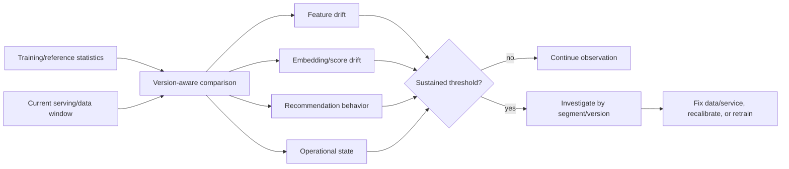
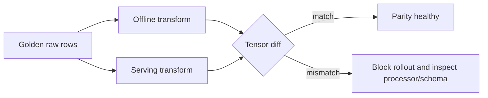

# Model, data, and operational monitoring

Monitoring compares current behavior with an expected reference and turns sustained deviations into
investigation or retraining decisions. Drift is evidence of change, not proof that model quality has
fallen.

## Distinguish the failure classes

| Class | Meaning | Observable evidence |
|---|---|---|
| Data drift | Input distribution changed | PSI, category mix, missingness, feature quantiles |
| Concept drift | Relationship between features and desired outcome changed | Mature-label performance decline conditional on inputs |
| Label drift | Outcome frequency/definition/delay changed | Positive rate, attribution window, event instrumentation |
| Training-serving skew | Online transformation differs from training | Unknown rate, parity probes, schema/version mismatch |
| Operational degradation | Serving system worsened | Latency, errors, fallbacks, cache, readiness, resource saturation |

## Monitoring pipeline



## Implemented frame comparison

The local drift utility compares common columns and reports row-count ratio, missing rates,
population stability index for numeric columns, and unknown-category rate for categorical columns.

For reference/current bin proportions \(p_b,q_b\), PSI is:

\[
PSI=\sum_b(q_b-p_b)\log\frac{q_b}{p_b},
\]

with clipped probabilities to avoid undefined logs. Bins derive from reference quantiles. Constant or
empty features return a neutral value and should also generate a data-quality interpretation.

## Recommended model-specific monitors

| Monitor | Why it matters | Segment dimensions |
|---|---|---|
| Unknown-category rate | Detect schema/taxonomy or source changes | Field, country, client version |
| Missing-value rate | Detect instrumentation loss | Field, source, event type |
| Embedding norm distribution | Detect collapse/scale shift | Tower, model version, cohort |
| Similarity score distribution | Detect geometry/index skew | retrieval/fallback, segment |
| Catalog coverage | Detect concentration | day, model, region |
| Popularity concentration | Detect head amplification | model, cohort |
| Fallback/empty rate | Detect feature/index/filter failures | safe fallback reason, route |
| Model/index age | Detect stale publication | active version |
| Head/tail/new-item outcomes | Detect uneven model quality | item cohort |

## Training-serving parity probes

Maintain a small non-sensitive golden set of raw feature records. Transform it during training and
inside a serving-compatible process, then compare encoded tensors exactly (or within numeric
tolerance). Also verify feature manifest checksum, vocabulary sizes, unknown rates, and model
dependency at startup.



## Threshold design

Avoid a single universal drift threshold. Use warning and critical bands, minimum sample counts,
sustained windows, seasonality-aware baselines, and segment context. Pair drift alerts with a
runbook question: *What action becomes safe and necessary if this fires?*

Example policy:

```text
warning: unknown rate doubles and exceeds 1% for 30 minutes
critical: unknown rate exceeds 10% for 10 minutes
action: compare client/source schema, active feature version, and deployment start time
```

## Retraining triggers

Retraining is appropriate when mature-label segment performance declines, important drift is
sustained and understood, catalog/user behavior has materially changed, model age exceeds policy, or
new features/objectives require it. Do not retrain to mask a broken input feed or incompatible
serving processor; fix the operational root cause first.

Promotion after retraining repeats data quality, exact/ANN evaluation, compatibility, security,
shadow/canary, and online experiment gates.

