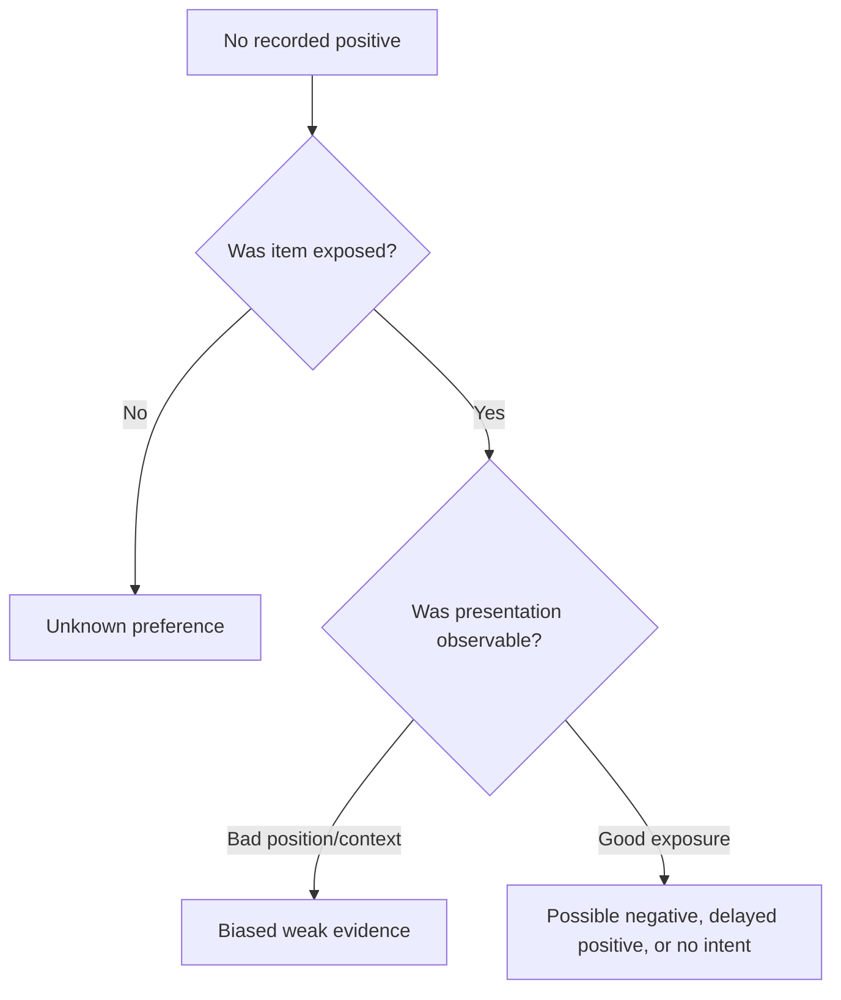
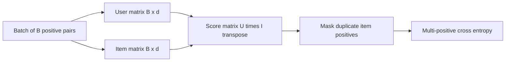
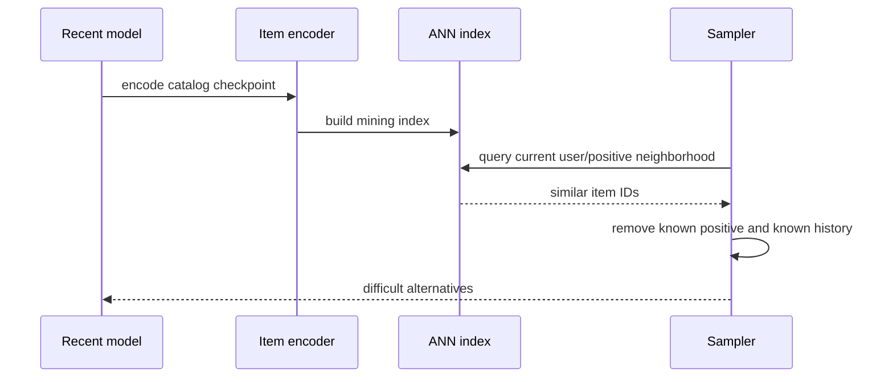

# Negative sampling

Full-catalog softmax is expensive because each positive would compete with every eligible item.
Sampling approximates that competition. The sampler determines which decision boundary receives
gradient, so its distribution is part of the learning objective.

## Why “unobserved” is not “negative”

A randomly sampled catalog item is usually an *assumed negative*. Known user positives should be
excluded when possible, but incomplete histories mean accidental positives can still occur.

## Implemented strategies

| Strategy | Distribution | Learning effect | Cost |
|---|---|---|---|
| In-batch | Other items paired in the batch | Efficient and increasingly hard as model improves | One score matrix; batch-dependent |
| Uniform | Equal probability over candidate IDs | Broad catalog coverage; many easy negatives | Cheap |
| Popularity weighted | Probability proportional to observed count/power | Competes against frequently exposed items | Cheap after alias/weight preparation |
| ANN hard negative | Top similar items from an index/checkpoint | Focuses on current confusions | Index build/query and staleness management |

The native trainer currently wires in-batch softmax. The explicit uniform, popularity, and hard
samplers are implemented/tested components; selecting those strategies in the current trainer fails
clearly rather than silently pretending sampled-softmax training occurred.

## In-batch geometry

For \(B\) pairs, one matrix multiplication produces \(B^2\) comparisons. Each row has approximately
\(B-1\) alternatives. Larger batches provide more negatives and a stronger denominator, but change
loss difficulty and memory cost. Learning-rate and temperature comparisons should therefore hold
effective batch size constant.

## Uniform sampling

For eligible catalog \(\mathcal{I}\):

\[
q_{uniform}(i)=\frac{1}{|\mathcal{I}|}.
\]

Uniform sampling exposes tail items more often than traffic does, which can improve representation
coverage. In a large catalog most uniform negatives are trivially unrelated, so their gradients
quickly vanish.

## Popularity sampling and correction

For item count \(c_i\) and exponent \(\alpha\):

\[
q_{pop}(i)=\frac{(c_i+\epsilon)^\alpha}{\sum_j(c_j+\epsilon)^\alpha}.
\]

This produces harder, traffic-representative alternatives but can reinforce head dominance. If
sampled logits are intended to approximate a different target distribution, importance correction
subtracts \(\log q(i)\) from logits. The current component validates distributions but does not claim
a correction-enabled sampled-softmax trainer.

## Hard-negative mining

Hard negatives should be refreshed often enough to reflect current geometry but not so often that
index build cost dominates training. They must exclude the known positive. Filtering known history
reduces false negatives but cannot eliminate unlabeled relevance.

## Failure modes and mitigations

| Failure | Symptom | Mitigation |
|---|---|---|
| Accidental positive | Model pushes relevant neighbors away | Multi-positive masks, history exclusion, debiased loss |
| Easy-negative saturation | Low loss but poor fine-grained ranking | Mix random and hard negatives |
| Popularity domination | High head recall, low coverage/novelty | Temper popularity, tail sampling, segment metrics |
| Stale hard index | Negatives no longer reflect model | Version mining index and refresh on schedule |
| Duplicate IDs | False negative inside batch | Identity-aware positive mask |
| Tiny batch | Weak denominator and noisy gradients | Accumulation/cross-batch memory extension |

Cross-batch memory can retain recent item embeddings to enlarge the negative pool without a huge
batch, but embeddings become stale and distributed synchronization becomes a systems problem.

## Tests and invariants

The suite verifies fixed-seed determinism, exclusion of known positives when alternatives exist,
approximate uniform/popularity distribution behavior, hard-negative positive exclusion, and clear
failure for invalid catalog/weight configurations.

