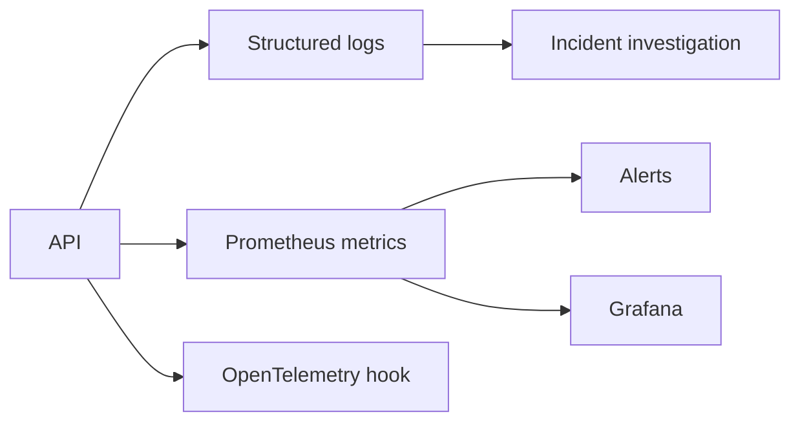

# Observability

Production logging is JSON and should include timestamp, severity, service/environment, request and
trace IDs, artifact versions, latency, and a stable salted user hash—never raw profile attributes or
raw identifiers. Prometheus metrics cover request count/latency, fallback reason, cache hits,
returned item counts, and readiness without user/item labels that would cause high cardinality.

An OpenTelemetry SDK adapter is an optional extra; propagate W3C trace context at the gateway. Add
user-tower, ANN, reranking, cache, queue, index load/age, and empty-result instruments before traffic
scale testing. Alerts should combine symptoms (latency/error/fallback) with artifact age rather than
page on a single noisy series.
