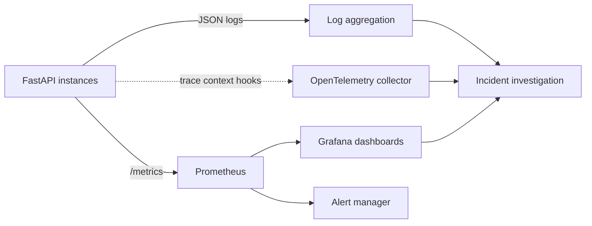
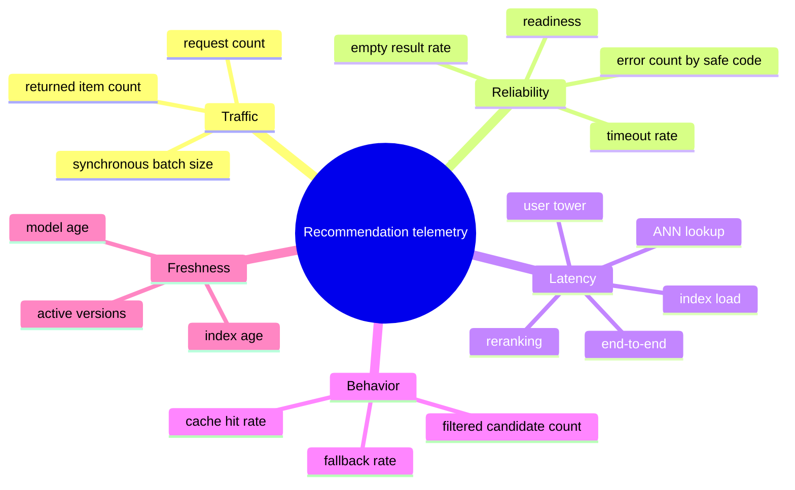
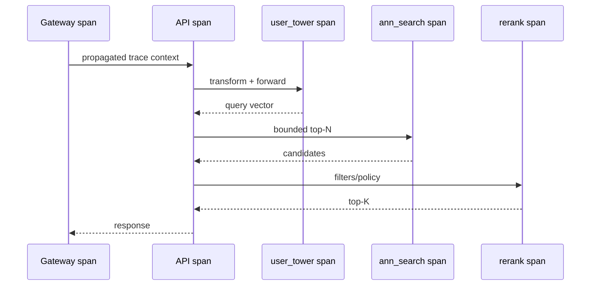

# Observability

Observability answers what the service is doing now. It combines structured logs, bounded-cardinality
metrics, and tracing integration points. Model/data drift is covered separately in
[monitoring](monitoring.md).

## Signal flow

Prometheus and Grafana configuration examples are included under `deploy/`. OpenTelemetry is an
integration layer, not a bundled collector claim.

## Structured logging

Production logging emits JSON records suitable for ingestion. A request record should include:

| Field | Reason | Cardinality policy |
|---|---|---|
| timestamp/severity/service/environment | Basic event context | Bounded |
| request ID | Correlation across one request | Logs only, never a metric label |
| trace/span IDs | Cross-service correlation | Logs/traces only |
| route/status/error code | Aggregation and alerting | Use normalized route template |
| model/index version | Deployment diagnosis | Bounded active versions |
| hashed user identifier | Debug repeated behavior without raw PII | Logs only; salted deployment hash |
| stage latency | Diagnose tower/search/rerank | Numeric fields |
| fallback/cache flags | Behavior diagnosis | Boolean/enumerated |

Never log raw request bodies, user features, embedding coordinates, allow/deny lists, tokens,
credentials, or stack traces in client-visible messages.

## Metrics model

Avoid labels containing user ID, item ID, request ID, experiment ID, error text, or arbitrary
category. High cardinality can exhaust the metrics backend and become a denial-of-service vector.

## Suggested service-level indicators

| SLI | Example calculation | What it detects |
|---|---|---|
| Availability | successful non-5xx requests / valid requests | Service/runtime failure |
| Readiness convergence | ready pods / desired pods after rollout | Bundle loading problems |
| Latency | p95/p99 request histogram | Saturation or slow index/filtering |
| Non-empty eligible rate | responses with >=1 item / successes | Catalog/filter/fallback failure |
| Fallback rate | fallback responses / successes | User-feature/model/index degradation |
| Cache hit rate | hits / cache lookups | Cache effectiveness or key/version issue |

SLO thresholds must be chosen from product criticality and capacity tests. Example values in alert
rules are starting points, not universal promises.

## Trace decomposition

Trace sampling should retain errors and tail latency while controlling cost. Do not attach raw
identity or candidate lists to spans.

## Dashboard layout

A useful dashboard reads top-to-bottom:

1. traffic, success, p50/p95/p99, and ready instances;
2. stage latency and errors by safe code;
3. fallback, empty, cache, and returned-item distributions;
4. active model/index versions and ages;
5. pod CPU/memory/restarts and index load duration;
6. links to offline drift/model reports for the active versions.

During a rollout, split panels by bounded model/index version. Remove retired version labels after
the rollback window to limit cardinality.

