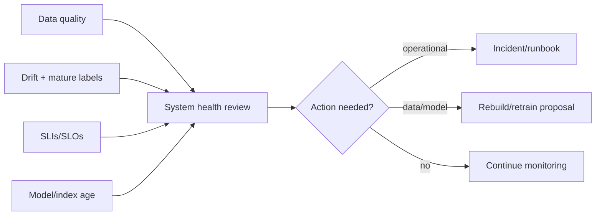
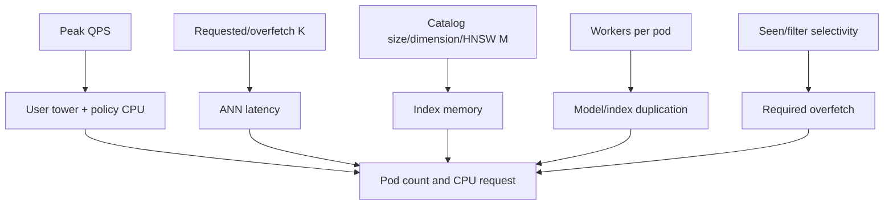
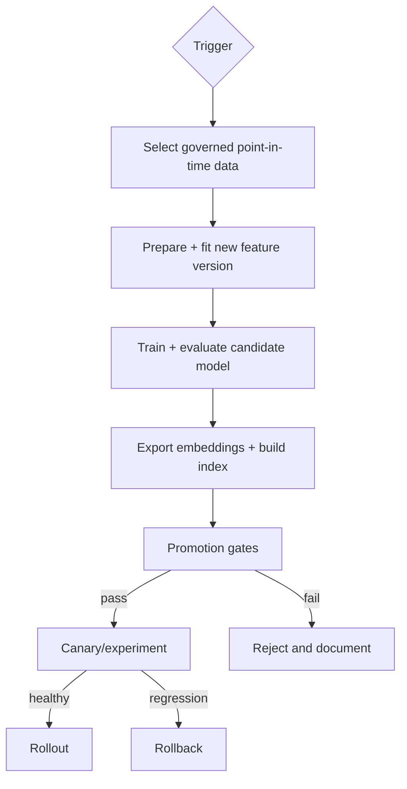
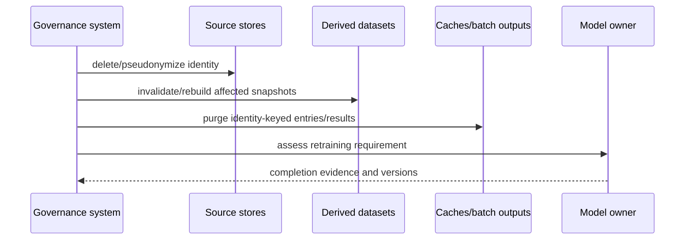

# Production operations

Operations manages bundle freshness, safe rollout, capacity, incidents, deletion, and retraining.
The central rule is to treat feature processor, model, embeddings, and index as one compatibility
unit.

## Daily operating view

Review active versions, readiness convergence, request/error/tail latency, fallback/empty rates,
cache health, item coverage, model/index age, input missing/unknown rates, and batch job freshness.

## Release checklist

### Before deployment

1. input snapshot and quality report approved;
2. processor/model/embedding/index manifests verify;
3. exact metrics and important segments meet promotion criteria;
4. ANN recall/latency/memory measured for production backend;
5. security/dependency/container scans pass;
6. deletion and unavailable-item state is current;
7. rollback bundle is retained and load-tested;
8. dashboards and alerts recognize candidate versions.

### During deployment

1. candidate pods load without checksum/compatibility errors;
2. startup/readiness timing is within budget;
3. canary receives bounded traffic;
4. compare errors, latency, returned count, fallback, coverage, and resource use by version;
5. halt or rollback on guardrail breach.

### After deployment

1. confirm all serving instances report intended versions;
2. monitor at least one representative traffic cycle;
3. retain old bundle through rollback window;
4. record deployment decision and observed metrics;
5. start mature-label comparison when attribution window closes.

## Capacity model

Load-test known, cold-feature, and fallback paths; selective allow/category filters; large seen
histories; cache hit/miss/unavailable; concurrent startup; and index swap. Measure p50/p95/p99,
throughput, saturation, memory high-water mark, and short/empty result rate.

## Retraining and rebuild cadence

Use a policy combining maximum age, material catalog change, mature-label regression, sustained
drift, and feature/objective releases. Item-only changes may allow re-encoding/reindexing under the
same model, but any processor/model change requires full downstream rebuild.

## Rollback

Rollback must restore a complete known-good bundle. Do not point a previous model at a newer index
unless their manifests explicitly match. See the [bundle rollback runbook](runbooks/bundle-rollback.md).

## User deletion workflow

Document SLA, tombstone propagation, backups, audit record, and whether model retraining is required.

## Incident priorities

Protect user safety and data confidentiality first, then correctness, availability, latency, and
freshness. When uncertain about bundle integrity, remove affected instances from readiness rather
than bypassing checksum or compatibility checks.

