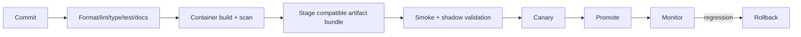

# Operations and runbooks

Before promotion, verify dataset/feature/model/embedding/index manifests, exact-vs-index recall,
fallback lists, deletion tombstones, API contract, capacity, dashboard, and rollback bundle. Canary
on a small traffic slice and compare latency, errors, fallback, coverage, popularity concentration,
and product guardrails. Never infer business success from offline gains alone.

If readiness fails, inspect artifact checksums and version dependencies before restarting. For a bad
index, direct the version pointer to the previous complete bundle; do not overwrite directories. For
drift alerts, confirm source freshness and schema before retraining. Incident logs must use request
IDs and salted identifiers only.
