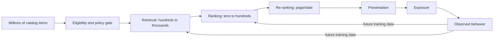
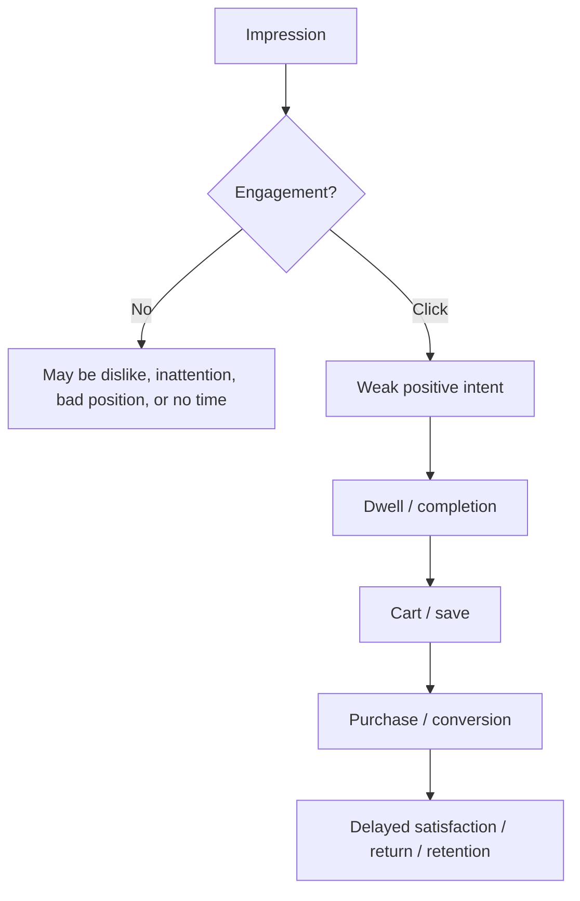
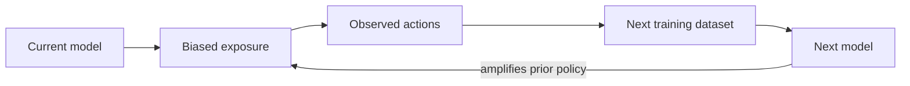
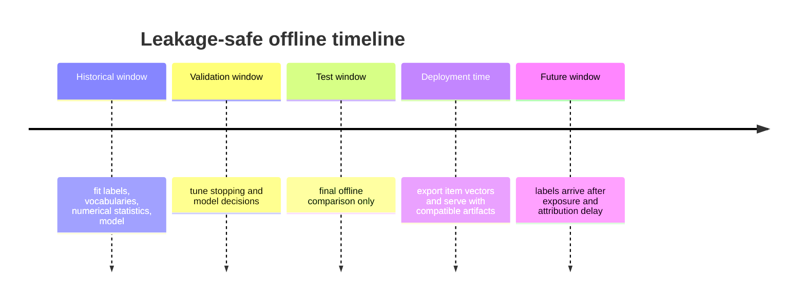
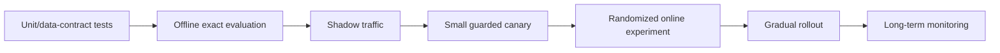

# Recommendation-system fundamentals

Recommendation is constrained decision-making under incomplete and biased feedback. The system
does not observe a user's complete preference function. It observes which items were exposed, how
the interface presented them, and a delayed subset of actions. Architecture and metrics must be
read in that context.

## The staged recommendation problem

### Candidate generation / retrieval

Retrieval asks: *Which small subset is worth scoring more carefully?* It needs high recall under a
strict latency and cost budget. This repository implements neural two-tower retrieval completely,
including offline item vectors, indexing, online query vectors, filters, and fallbacks.

### Ranking

Ranking scores retrieved candidates with features that can combine the user and item directly:
user-item history, price sensitivity, query-item token interactions, current inventory, predicted
conversion, margin, or calibrated uncertainty. Cross features make ranking more expressive but
prevent precomputing a single item vector, so ranking is applied to a much smaller set.

### Re-ranking and slate construction

Re-ranking turns independently scored candidates into a coherent page. It can enforce category
caps, deduplicate variants, diversify creators, reserve exploration capacity, boost freshness, or
satisfy legal and inventory rules. This repository implements a lightweight policy stage to make
that boundary concrete; it is not a learned ranker.

## Major recommendation approaches

| Approach | Signal | Strength | Main limitation |
|---|---|---|---|
| Popularity | Aggregate interactions | Robust fallback; no identity required | Weak personalization; feedback concentration |
| Content based | Item/user attributes | Handles new items with metadata | Can overspecialize; depends on feature quality |
| Collaborative filtering | Co-interaction patterns | Discovers latent taste beyond metadata | Identity-heavy cold start and sparse tails |
| Matrix factorization | Learned user/item vectors | Efficient dot-product retrieval | Usually static, linear interaction model |
| Neural retrieval | IDs, metadata, context, sequences | Flexible feature fusion; scalable item precompute | Sampling-sensitive; approximate-search trade-offs |
| Cross-encoder/ranker | Joint user-item features | Rich interactions and calibrated objectives | Too expensive for full-catalog scoring |

Two-tower retrieval generalizes matrix factorization: each side is a learned function rather than a
single lookup vector. ID embeddings retain collaborative signal, while metadata and numerical
features provide content signal and cold-start paths.

## Implicit and explicit feedback

Explicit feedback, such as a rating, directly expresses a preference but is sparse and
self-selected. Implicit feedback—impression, click, view, dwell, cart, purchase—is abundant but
ambiguous.

A missing interaction is not a clean negative. The user may never have seen the item. Even an
impression without a click is affected by position, creative, page context, and competing items.
This is why negative sampling and exposure logging are model-design decisions, not implementation
details.

## Bias taxonomy

### Exposure bias

Only exposed items can receive most outcomes. If the existing recommender never shows long-tail
items, training data cannot reveal whether users would like them.

### Selection bias

Users choose when and how to interact. Ratings disproportionately represent motivated users and
strong opinions. Purchases reflect budget and availability as well as preference.

### Position bias

Higher positions receive more attention independent of relevance. The synthetic generator models
this by decreasing positive probability as position grows. A production pipeline should record the
serving policy and propensity or run randomized interventions when causal correction is required.

### Popularity bias

Popular items are exposed more, collect more labels, and become easier for the model to retrieve.
This can improve short-term engagement while collapsing catalog coverage and novelty.

### Feedback loops

Monitoring coverage, head-versus-tail performance, fallback rate, and popularity concentration can
detect symptoms. It does not identify causal impact on its own.

## Cold start

| Segment | Why identity signal fails | Useful response |
|---|---|---|
| New user, known features | User ID unseen | Encode country/language/tier/preferences/context |
| New user, no features | No personalization evidence | Segment or global popularity plus freshness/exploration |
| New item, rich metadata | Item ID unseen | Encode category/language/brand/price/text representation |
| New item, little metadata | No behavioral or content signal | Editorial rules, exploration allocation, quality gate |
| Sparse user | Few noisy outcomes | Blend retrieval with robust priors and wider diversity |

The online runtime uses optional supplied user features for a cold-start tower path. If those are
absent or insufficient, it returns eligible popularity/freshness fallbacks. It does not return an
empty response solely because the identity is unknown.

## Leakage and delayed labels

Leakage occurs whenever training uses information unavailable at the prediction timestamp. Common
examples include fitting vocabularies on the full dataset, calculating lifetime popularity with
future events, constructing user history from validation/test outcomes, or randomly splitting
interactions so later behavior helps predict earlier behavior.

Random interaction splitting is particularly misleading because the same user's future tastes and
the same item's future popularity appear in training. This repository uses global time boundaries:

For real systems, label maturity matters. A purchase objective may need hours; retention may need
weeks. Training too early turns not-yet-observed positives into false negatives.

## Exploration versus exploitation

Exploitation chooses the highest predicted utility under the current model. Exploration spends
some opportunity cost to learn about uncertain users/items and prevent data starvation. Common
strategies include epsilon-greedy selection, upper-confidence bounds, Thompson sampling, or fixed
new-item slots. Exploration must be policy-controlled, measurable, and safe; simply increasing
randomness in ANN retrieval is not an experimentation strategy.

## Offline versus online evidence

Offline evaluation answers whether a model recovers held-out interactions under a reconstructed
candidate protocol. It is excellent for correctness, regression detection, and rejecting weak
models cheaply. It cannot prove incremental clicks, conversion, retention, marketplace balance,
or user trust because the logged data came from a different policy.

A responsible release sequence is:

