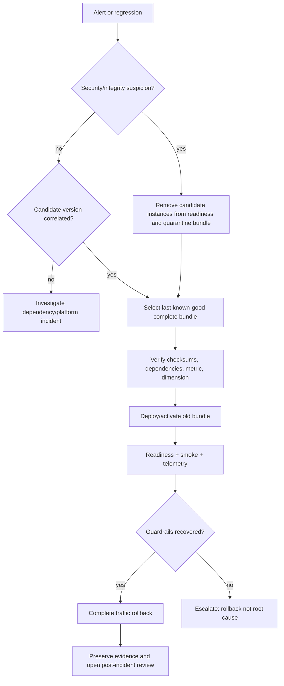

# Runbook: model/index bundle rollback

Use this runbook when a newly deployed compatible bundle causes elevated errors, latency, fallback,
empty results, behavioral regression, or suspected artifact integrity problems.

## Preconditions

- a previously validated complete feature/model/embedding/index bundle is retained;
- the prior image/config combination remains deployable;
- operators can change traffic or deployment revision;
- the incident has an owner and UTC timeline.

## Decision flow

## Procedure

1. record current image digest, configuration hash, model/index/feature versions, and alert state;
2. stop further promotion; do not delete candidate artifacts;
3. verify the known-good bundle with `inspect-artifact` and its deployment configuration;
4. deploy the prior complete bundle or restore its atomic routing pointer;
5. wait for startup and readiness; verify `/version` reports the intended pair;
6. run a known-user and unknown-user smoke request;
7. compare errors, p95/p99, fallback, empty results, returned count, CPU/memory, and coverage proxy;
8. shift all traffic only after recovery evidence;
9. quarantine the failed bundle from automatic selection;
10. preserve logs/reports/manifests and document cause/corrective action before re-release.

## Never do

- do not pair the old model with the new index unless manifests explicitly declare compatibility;
- do not bypass checksum verification;
- do not mutate published files to make versions appear compatible;
- do not delete evidence before security/data owners assess it.

