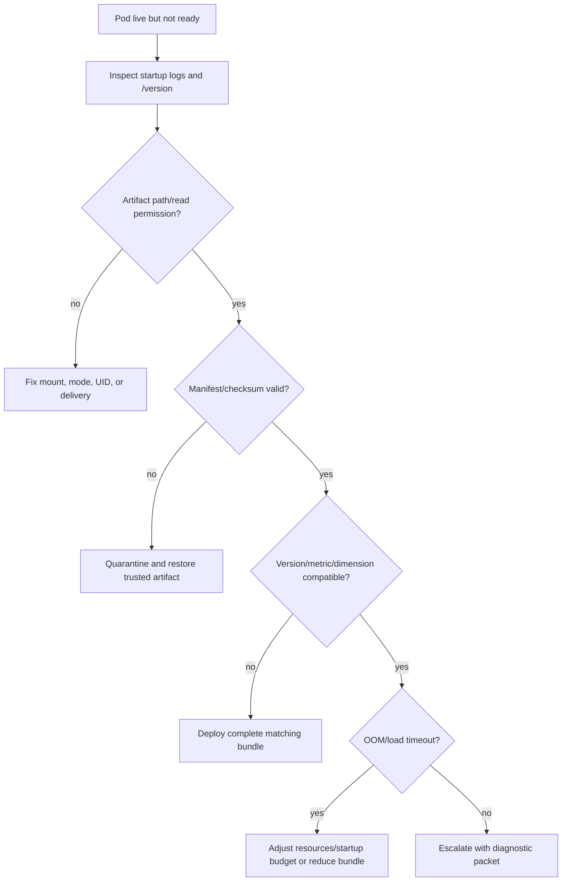

# Runbook: readiness failure after deployment

## Triage



## Diagnostic commands

```bash
kubectl describe pod POD -n recommender
kubectl logs POD -n recommender --previous
kubectl logs POD -n recommender
kubectl get events -n recommender --sort-by=.lastTimestamp
uv run recommender inspect-artifact artifacts/models/model-v001 --config configs/production.yaml
uv run recommender validate-index --config configs/production.yaml
```

Run local artifact commands only against the exact bundle mounted in the failing revision. Preserve
the safe error and manifest; do not include secrets or raw user data in escalation.

