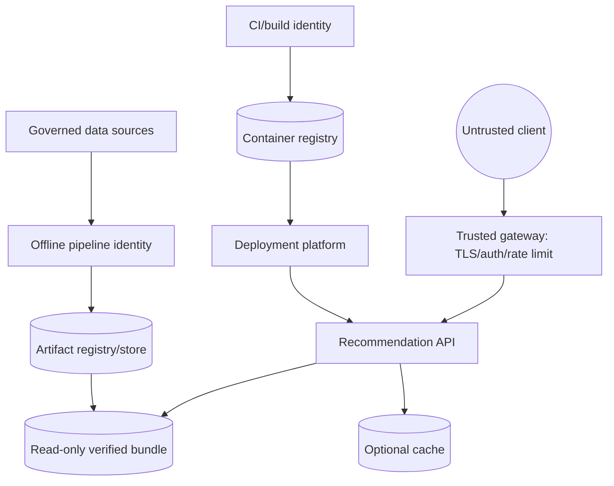
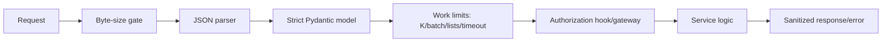
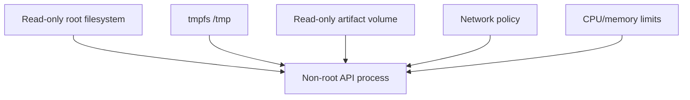
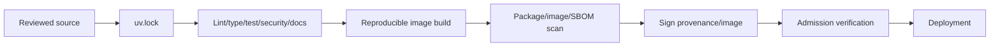

# Security, privacy, and threat model

The service handles behavioral data and exposes a model-derived API. Security therefore spans HTTP
abuse, data poisoning, artifact integrity, supply chain, privacy, and operational authorization.

## Trust boundaries



The local project implements payload/schema limits, safe errors, checksums, contained artifact
inspection, safe tensor/array loading, non-root containers, and secret/dependency scanning. TLS,
identity-aware authorization, global rate limiting, signed artifact promotion, and cloud secret
management are platform responsibilities.

## Threat matrix

| Threat | Attack path | Impact | Implemented control | Required extension |
|---|---|---|---|---|
| Malicious payload | Huge/deep/invalid JSON, oversized lists | CPU/memory exhaustion | Byte limit, strict schema, K/batch bounds, timeout | Gateway WAF and concurrency/rate limits |
| Enumeration | Probe user/item IDs or embedding route | Privacy/catalog leakage | Safe unknown behavior, no stack traces | Authentication, per-principal policy, route restriction |
| Model extraction | Repeated score/embedding queries | Approximate model geometry | Bounded outputs; ordinary responses hide vectors | Disable/restrict embedding endpoint, quotas, anomaly detection |
| Membership inference | Compare outputs for identities/items | Infer training presence | Fallback and minimal explanation | Privacy review, aggregation, DP research where warranted |
| Data poisoning | Inject fake interactions/entities | Biased model and exposure | Validation, deterministic reports, manifests | Source identity, anomaly/volume controls, approval workflow |
| Artifact tampering | Replace model/index/manifest | Arbitrary behavior or unsafe load | SHA-256, dependency checks, weights-only/no-pickle loading | Manifest signatures, immutable registry, promotion RBAC |
| Unauthorized replacement | Legitimate artifact promoted by wrong actor | Supply-chain compromise | Version metadata/readiness checks | Separation of duties, signed provenance, admission policy |
| Dependency compromise | Malicious/vulnerable package or action | Build/runtime compromise | Lockfile, pip-audit, Dependabot, pinned runtimes | Provenance/SBOM/signing, controlled registries |
| Sensitive logging | Raw IDs/features/body in logs | Privacy incident | Structured safe fields, identifier hashing utility | Central log policy/DLP and retention enforcement |
| Path traversal | Artifact CLI or crafted path escapes root | Read arbitrary files | Resolved path containment check | Filesystem sandbox/RBAC |
| Cache poisoning | Cross-version or attacker-controlled entry | Incorrect recommendations | Typed adapter and version-aware key design | Authenticated Redis/TLS/network policy |

## Request hardening



CORS is deny-by-default unless origins are configured. CORS is a browser policy, not authentication.
The application should run behind a gateway that validates identity, scopes endpoints, enforces
global/per-principal quotas, and terminates modern TLS.

## Artifact-loading rules

1. resolve the expected version directory under the configured root;
2. parse a strict manifest;
3. verify every declared checksum;
4. verify upstream versions and metric/dimension contracts;
5. use restricted formats (`weights_only`, JSON, numeric/Unicode arrays without pickle);
6. load into a candidate bundle before changing readiness/traffic;
7. record active model/index versions in telemetry.

Checksums are integrity, not authenticity. Use signed manifests and immutable storage in production.

## Container and Kubernetes posture

The runtime image is multi-stage and runs as numeric UID/GID 10001. Compose/Kubernetes examples use
a read-only root filesystem, dropped capabilities, no privilege escalation, seccomp runtime default,
resource bounds, and read-only artifact mounts. Network policy restricts traffic patterns.



Image minimality reduces attack surface but the ML runtime remains large because PyTorch and FAISS
are substantial native dependencies. Scan the final image, not only Python requirements.

## Privacy lifecycle

Behavioral identifiers should be pseudonymous and purpose-limited. Define:

- collection purpose and lawful basis;
- raw and derived retention windows;
- access roles for event, feature, model, and log stores;
- deletion propagation through raw snapshots, prepared data, caches, batch outputs, and retraining;
- incident response and audit evidence;
- whether model influence requires retraining for high-assurance deletion.

Hashing an identifier for logs is pseudonymization, not anonymization. Use a deployment-secret salt,
rotate it under policy, and never use a short/public salt.

## Supply-chain controls



The repository implements lockfile installation, Ruff, mypy, pytest, Bandit, detect-secrets,
pip-audit, Dependabot, and Docker build checks. SBOM/provenance signing and cluster admission are
documented extensions.

## Review commands

```bash
make security
uv run bandit -c pyproject.toml -r src
uv run detect-secrets scan --baseline .secrets.baseline
uv run pip-audit
docker build -t two-tower-recommender:review .
```

Dependency audit requires current vulnerability data and therefore network access. Never commit real
secrets; `.env.example` contains placeholders only.

