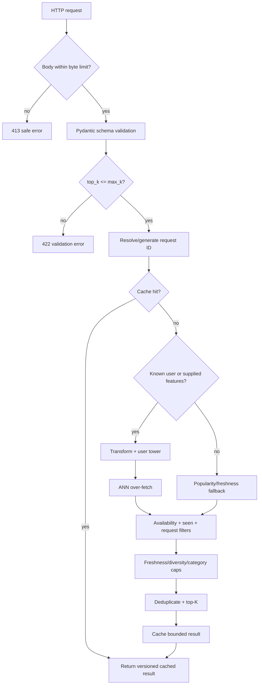
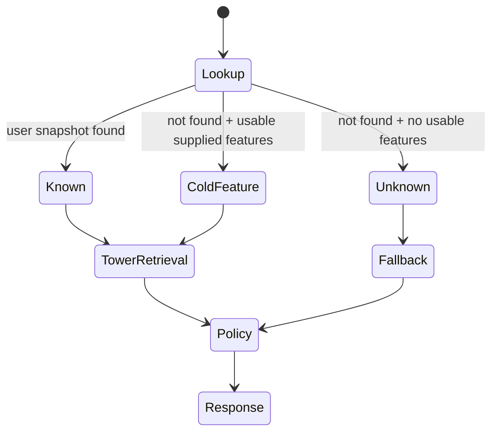

# Online serving

The FastAPI service loads one immutable, compatible recommendation bundle during startup and serves
read-only concurrent requests. It performs candidate retrieval and policy reranking; it does not
claim to be a learned final ranker.

## Endpoint map

| Method/path | Purpose | Readiness required |
|---|---|---:|
| `GET /health/live` | Process event loop is alive | No |
| `GET /health/ready` | Compatible runtime loaded | Yes |
| `GET /version` | Service/model/index versions | Runtime metadata |
| `GET /v1/model-info` | Safe model/index contract information | Yes |
| `GET /metrics` | Prometheus exposition | No |
| `POST /v1/recommendations` | Personalized/cold-start/fallback retrieval | Yes |
| `POST /v1/similar-items` | Item-to-item vector neighbors | Yes |
| `POST /v1/batch-recommendations` | Bounded synchronous multi-user request | Yes |
| `POST /v1/item-embedding` | Controlled item vector lookup | Yes |

`/v1/item-embedding` can aid trusted debugging but increases model-extraction surface. Restrict or
disable it at the gateway for public deployments.

## Request processing



## Recommendation request controls

The schema supports user ID, optional user features, optional request context, top-K, excluded IDs,
category filters, availability intent, maximum freshness age, allow/deny lists, request/experiment
metadata, and reranking configuration. Strict Pydantic models reject unknown fields.

Work is bounded by request byte limit, maximum K, maximum batch size, timeout, and over-fetch count.
These controls reduce accidental overload but are not a substitute for gateway rate limiting.

## Known, cold-start, and unknown users



Known users use persisted transformed features. Cold-feature requests construct a bounded user row
and map unseen values to `<UNK>`. Unknown users receive eligible popularity/freshness candidates and
`fallback_reason="unknown_user"`. If filters remove too many retrieval candidates, fallback can fill
eligible gaps and reports `insufficient_filtered_candidates`.

## Filtering order

Hard constraints execute before soft reranking:

1. remove duplicate IDs;
2. remove unavailable items;
3. remove previously seen/consumed items;
4. apply explicit excluded IDs and deny list;
5. apply allow list when present;
6. apply category and freshness constraints;
7. add freshness score and diversity/category policies;
8. truncate to K.

The service over-fetches from the index because hard filtering may discard many candidates. Capacity
testing should measure the relationship among seen-history size, filter selectivity, over-fetch, and
empty/short-result rate.

## Reranking

The policy score combines retrieval relevance with optional freshness weighting. Diversity uses a
greedy penalty inspired by maximal marginal relevance and category quotas. `diversity_lambda=1`
prefers relevance; lower values give category redundancy a larger penalty. `max_per_category`
enforces a hard cap.

This policy uses category-level diversity, not semantic pairwise embedding similarity. It is
deterministic and explainable but less expressive than a learned slate optimizer.

## Cache behavior

The in-memory cache is bounded and thread-safe. Keys hash the recommendation-relevant request
fields; cached responses preserve model and index versions. TTL expiration and bounded capacity
prevent indefinite growth. A Redis-compatible adapter provides an external state boundary.

Do not share cache entries across model/index versions unless the version is part of the key.
Deployment should prefer cache bypass over serving corrupt or cross-version results when Redis is
unavailable.

## Response contract

Each response includes request ID, user ID where appropriate, ordered item IDs, retrieval scores,
optional final scores, ranks, safe reason metadata, model/index versions, latency breakdown, cache
hit, and fallback reason. It does not expose raw embeddings in ordinary recommendation responses,
internal feature values, or stack traces.

## Health semantics

Liveness answers “should the process be restarted?” Readiness answers “can this instance safely
serve its configured bundle?” Missing/corrupt/incompatible artifacts keep readiness false while
liveness can remain true, allowing operators to distinguish dependency rollout failure from process
failure.

## Local request

```bash
uv run recommender serve --config configs/demo.yaml
curl --fail-with-body http://127.0.0.1:8000/v1/recommendations \
  -H 'content-type: application/json' \
  -H 'x-request-id: example-001' \
  -d '{"user_id":"u000001","top_k":5,"excluded_item_ids":[]}'
```

## Production checklist

- terminate TLS and authenticate/authorize at a trusted boundary;
- enforce per-principal/global rate and concurrency limits;
- restrict debug/embedding routes;
- set worker count based on model/index memory duplication;
- alert on latency, error, fallback, empty, cache, model age, and index age;
- use blue-green compatible bundle loading and rollback;
- hash identifiers in logs with a deployment-specific secret salt;
- size timeout and over-fetch from representative traffic, not demo defaults.

