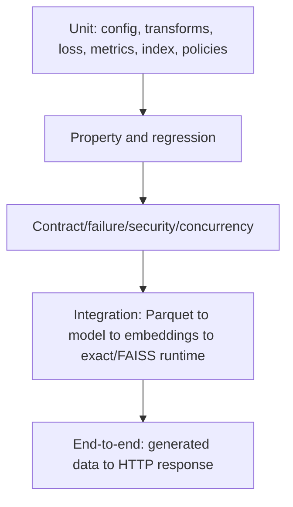
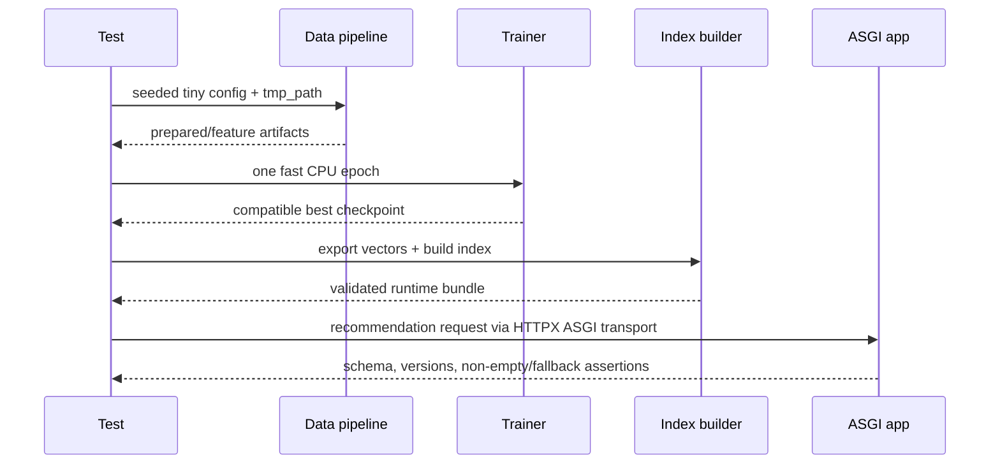

# Testing strategy and requirement matrix

The suite tests public behavior across pure functions, artifact boundaries, the complete pipeline,
HTTP contracts, concurrency, failures, security, and bounded performance. Deterministic seeds and
temporary directories keep tests isolated; unit tests make no external network calls.

## Test pyramid



The shape is deliberately wider at unit/property levels. End-to-end tests prove composition but are
too coarse to diagnose every edge case.

## Categories

| Directory/marker | Scope | Examples |
|---|---|---|
| `tests/unit` | Deterministic components | config validation, temporal split, vocabulary, loss, metrics, cache |
| `tests/property` | Invariants over generated inputs | rerank deduplication/filter bounds |
| `tests/regression` | Historical failure locks | contiguous padding/unknown vocabulary indices |
| `tests/contract` | External schemas/surfaces | API responses/errors/limits, every CLI help command |
| `tests/integration` | Durable component composition | data→training→export→exact/FAISS→batch/tracking |
| `tests/e2e` | User-observable lifecycle | generated artifacts loaded by FastAPI request path |
| `tests/failure_injection` | Safe degradation/rejection | missing/corrupt/mismatched artifacts |
| `tests/concurrency` | Shared immutable state | index and cache behavior under parallel access |
| `tests/security` | Boundary abuse | path traversal and unsafe input rejection |
| `tests/performance` | Environment-tolerant bounds | exact lookup/API latency on bounded fixtures |

## Requirement matrix

| Requirement | Primary evidence |
|---|---|
| Strict config and compatibility | `test_config.py` |
| Synthetic determinism and malformed fixtures | `test_data.py` |
| Temporal leakage safety | `test_data.py` |
| Train-only vocabulary, unknowns, normalization | `test_features.py`, regression special-token test |
| Tower output shape and L2 normalization | `test_model.py` |
| Multi-positive/temperature/symmetric loss | `test_model.py` |
| Uniform/popularity/hard negative invariants | `test_sampling.py` |
| Ranking metric formulas and bounds | `test_metrics.py` + Hypothesis |
| Exact search, filters, reranking, cache | index/rerank/cache unit tests + property tests |
| Manifest checksums and version mismatch | artifact unit and failure-injection tests |
| Raw data through training/index/runtime | integration pipeline test |
| FAISS persistence/search | integration pipeline test |
| API schema, size limit, safe errors/readiness | contract tests |
| Unknown-user fallback and E2E schema | E2E/integration tests |
| Batch output manifest | integration test |
| MLflow-compatible logging | integration test with local SQLite |
| Shared-index/cache safety | concurrency tests |
| Path containment | security tests |
| CLI command availability and nonzero failures | CLI contract tests |

## Golden, property, and regression design

Golden metric tests use small hand-calculated rankings. Hypothesis asserts metric bounds and policy
invariants across diverse lists. Regression tests target behavior that previously failed rather
than snapshotting large incidental tensors.

Avoid brittle full-floating-point snapshots. Prefer shape, normalization, rank ordering, tolerance,
and contract assertions unless exact values are the behavior under test.

## Deterministic E2E flow



The tiny fixture is intentionally not a benchmark. It proves the lifecycle within CI time and
without a GPU/network.

## Coverage policy

The project targets at least 90% statement/line coverage and 85% branch coverage. Coverage excludes
thin CLI orchestration and protocol-only optional adapter boundaries where underlying behavior is
tested through contracts. Coverage is a floor, not evidence of correct test selection.

```bash
uv run pytest --cov=recommender --cov-branch --cov-report=term-missing
uv run pytest -m integration
uv run pytest -m e2e
uv run pytest -m security
uv run pytest -m performance
```

## Performance testing

Latency thresholds must identify runner hardware and catalog/query size. Report warm and cold
behavior separately, use percentiles rather than only means, control thread counts, and avoid failing
functional CI on noisy microsecond differences. Production load tests should cover concurrent user
tower inference, ANN search, selective filters, cache failure, bundle loading, and worker memory.

## Test hygiene

- create all artifacts under pytest `tmp_path`;
- never depend on test execution order;
- freeze seeds and avoid external services in unit tests;
- assert public outputs/errors rather than private call order;
- clean containers/test services after integration runs;
- mark expensive suites explicitly;
- reproduce a bug with a failing test before fixing it.

