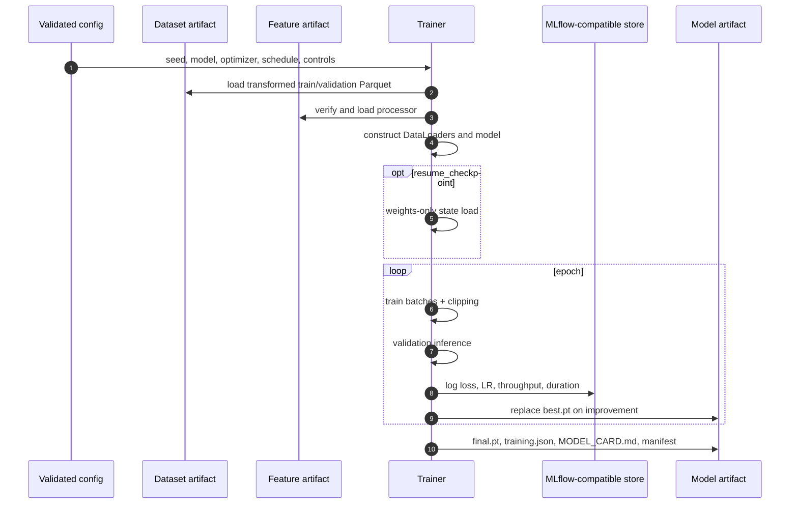
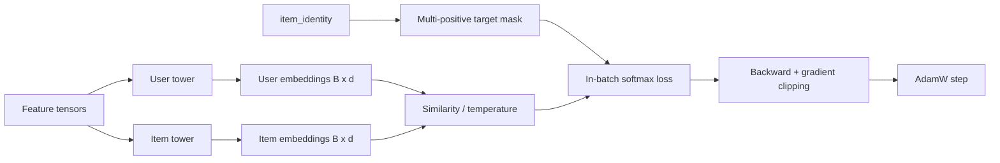
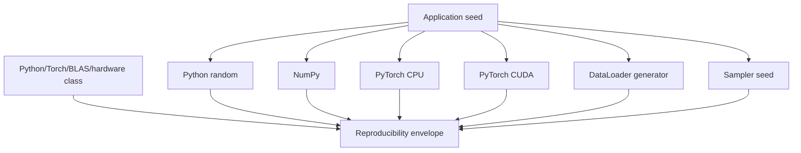

# Training pipeline

The trainer is a typed native-PyTorch loop designed for deterministic CPU development and single-GPU
execution. It consumes only transformed, versioned artifacts and publishes weights plus enough
metadata to audit how they were produced.

## Training sequence



## Batch construction

The interaction dataset selects positive rows and materializes the categorical and numerical tensor
columns expected by both towers. A seeded `torch.Generator` controls shuffled training order.
Validation uses a stable non-shuffled order. DataLoader worker count is configurable; worker seeding
must be extended explicitly when using multiple workers in stricter distributed settings.

Each batch contains aligned positive pairs and `item_identity` for duplicate-positive masking.

## Forward and objective



The default AdamW configuration separates optimization from weight decay. Gradient norm is clipped
before every optimizer step. CUDA autocast activates only when mixed precision is requested and the
selected device is CUDA; CPU remains full precision.

## Reproducibility controls

The seed utility sets Python, NumPy, and PyTorch seeds. Deterministic mode requests deterministic
PyTorch algorithms and configures backend behavior where possible.



Strict determinism can reduce accelerator throughput and restrict kernels. Equivalent runs mean
identical discrete outputs where deterministic kernels permit and numerically close floating-point
metrics on the same hardware class—not bitwise identity across arbitrary CPU/GPU stacks.

## Scheduling and early stopping

| Scheduler | Update | Suitable use |
|---|---|---|
| `cosine` | Decays LR over configured epoch horizon | Smooth bounded training runs |
| `plateau` | Reacts to validation loss | Unknown convergence horizon |
| `none` | Constant LR | Controlled experiments/debugging |

The best checkpoint updates only when validation loss improves by more than `1e-6`. Consecutive
non-improving epochs increment the stale counter; training stops at configured patience. Final
weights are always saved after normal completion. `KeyboardInterrupt` writes `interrupted.pt` and
marks an active tracking run killed before re-raising.

## Checkpoint resume

`resume_checkpoint` must be an existing `.pt` file. It is loaded with `weights_only=True`, mapped to
the selected device, and checked against the current model state dictionary. The path is recorded in
training metadata.

Current resume restores weights only. Optimizer moments, scheduler state, epoch counter, and stale
counter are not restored, so this is warm continuation rather than full fault-tolerant resumption.

## Tracking and model card

When tracking is enabled, configuration parameters and epoch metrics are logged to the configured
MLflow URI. Local configuration uses SQLite; Compose can run a standalone MLflow service. Network
tracking is explicit and never required by the default workflow.

The model artifact contains:

```text
artifacts/models/model-v001/
├── best.pt
├── final.pt
├── training.json
├── MODEL_CARD.md
└── manifest.json
```

`training.json` records loss history, best validation loss, parameter count, device, Python/Torch
versions, vocabulary sizes, throughput, learning rate, duration, and resume source. The card states
intended retrieval use and known limitations.

## Configuration example

```yaml
model:
  embedding_dim: 32
  id_embedding_dim: 16
  categorical_embedding_dim: 6
  hidden_dims: [64, 32]
  activation: gelu
  dropout: 0.1
  similarity: cosine
  temperature: 0.1

training:
  epochs: 3
  batch_size: 128
  learning_rate: 0.002
  weight_decay: 0.00001
  patience: 2
  gradient_clip_norm: 5.0
  deterministic: true
  mixed_precision: false
  negative_strategy: in_batch
  scheduler: cosine
```

Unknown fields and invalid bounds fail during Pydantic validation. Model similarity must equal the
index metric.

## Operational checks

Before promotion, require:

1. loss is finite and the best checkpoint exists;
2. parameter count and vocabulary shapes match expectations;
3. validation metrics beat agreed baselines by segment, not only globally;
4. embedding norms and similarity distributions are healthy;
5. downstream item export and exact retrieval succeed;
6. manifests and checksums validate;
7. model age, data window, code revision, and configuration are recorded.

```bash
uv run recommender train --config configs/demo.yaml
uv run recommender inspect-artifact artifacts/models/model-v001 --config configs/demo.yaml
```

