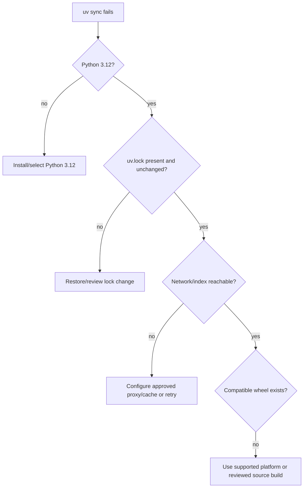
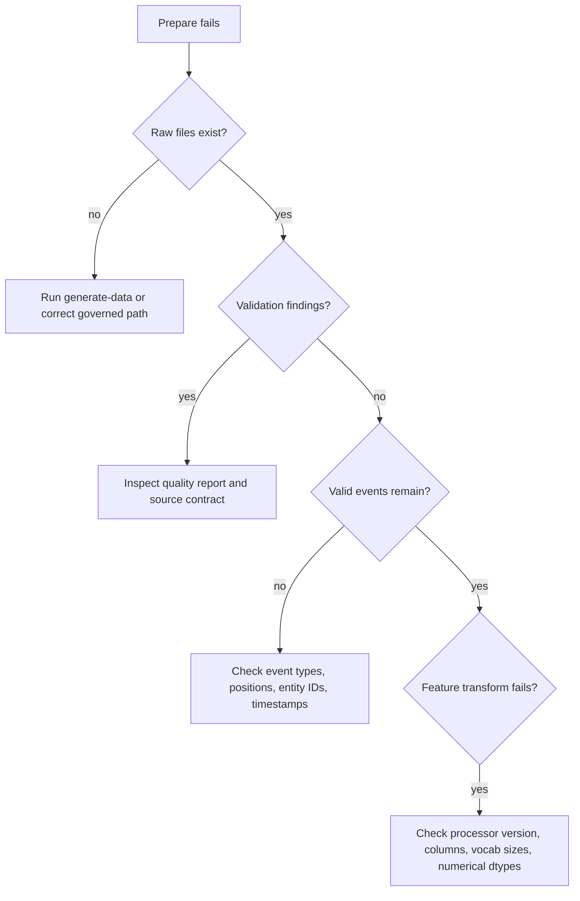
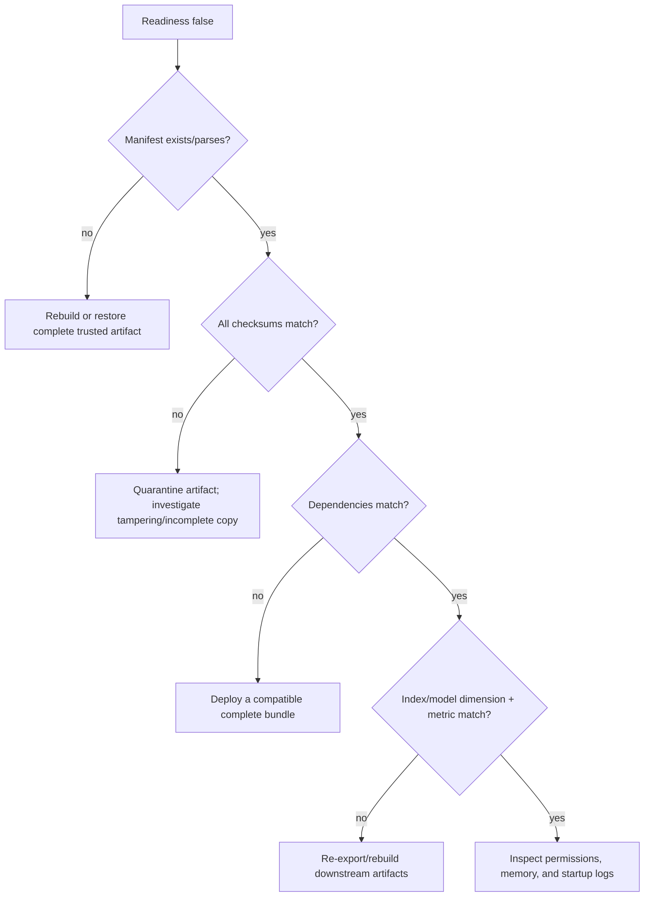

# Troubleshooting and diagnostic decision trees

Start with the failing lifecycle stage and preserve the exact error, configuration hash, and active
artifact versions. Do not “fix” integrity or compatibility errors by editing published manifests.

## Installation

Use `uv sync --frozen --all-extras` for reproducible validation. Do not regenerate the lock merely to
hide an unsupported interpreter/platform.

## FAISS problems

| Symptom | Diagnosis | Resolution |
|---|---|---|
| Import error | `ann` extra absent or wheel unsupported | `uv sync --extra ann`; use exact backend for correctness work |
| Dimension mismatch | Query/model/index lineage mixed | Inspect manifests; rebuild embeddings and index |
| Low ANN recall | HNSW `ef_search`/graph insufficient | Compare exact, raise search/build breadth, measure latency/memory |
| Slow load/high memory | Catalog/dimension/connectivity too large | Capacity test, shard, reduce dimension/M, or managed service |
| Wrong IDs | Vector/ID alignment or stale files | Reject index, rebuild from verified embedding artifact |

## Data and features

An empty training batch usually means no row meets the positive-event and weight threshold. Inspect
dataset manifest positive counts before changing the model.

## NaN or unstable loss

1. verify transformed numerical columns are finite;
2. verify categorical indices are within embedding table sizes;
3. inspect batch duplicate identities and empty positive masks;
4. increase temperature if logits are too sharp;
5. reduce learning rate and inspect gradient norm;
6. disable mixed precision to isolate CUDA numeric behavior;
7. confirm no corrupted checkpoint was resumed.

Do not add blanket `nan_to_num` in the loss; it hides the first invalid stage.

## Artifact/readiness failures

JSON manifests are mode 0644 for the non-root image, but parent directories and mounted volume must
also be readable by UID 10001.

## Empty or short recommendations

Check, in order: item availability, seen-item exclusion, explicit excluded/deny lists, allow-list
intersection, category filter, freshness threshold, index over-fetch, category cap, and fallback
pool eligibility. The response fallback reason and returned-item count narrow the stage.

Unknown users should receive fallback results if any eligible fallback item remains. A genuinely
empty eligible catalog is a data/business-policy incident, not a reason to return unavailable items.

## Slow retrieval/API

Split latency into feature transform, user tower, ANN lookup, filtering/reranking, and serialization.
Then inspect cache hit rate, K/over-fetch, filter selectivity, thread/BLAS oversubscription, index
memory pressure, concurrent requests, and worker duplication. Exact search is intentionally linear;
use HNSW only after measuring recall.

## Determinism failures

Compare seed, dataset/config hashes, Python/Torch/NumPy/FAISS versions, CPU/GPU class, deterministic
flag, DataLoader worker count, and approximate-index insertion order. Define tolerances for floats and
tied rankings; require exact equality for manifests, schemas, token indices, and temporal splits.

## Docker/Kubernetes

| Symptom | Likely cause | Action |
|---|---|---|
| Container OOM | Index/model duplicated per worker | One worker per pod, raise memory, reduce/shard index |
| Startup probe fails | Artifact download/load exceeds budget | Measure load, tune startup probe, pre-stage bundle |
| Readiness flaps | Mutable/incomplete mounted artifacts | Publish immutable version and atomic pointer only |
| Permission denied | Host artifact modes/UID mismatch | Correct read-only ownership/mode; keep non-root user |
| Rollout stalls | Candidate bundle corrupt/incompatible | Inspect candidate logs/manifests; rollback deployment |
| HPA adds pods but latency remains | Shared downstream/cache/index bottleneck | Inspect saturation and dependency capacity |

## Escalation packet

Include request ID (not user PII), UTC time window, environment, image digest, active model/index/
feature versions, safe error code, relevant metric screenshots, manifest verification outcome,
deployment change, and reproduction command. Never paste secrets, raw features, or full request
bodies into tickets.

