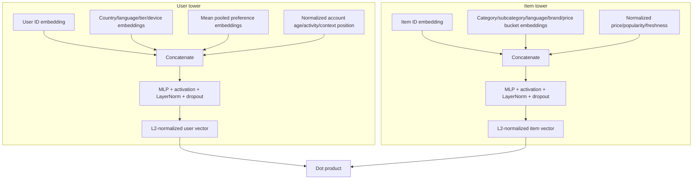
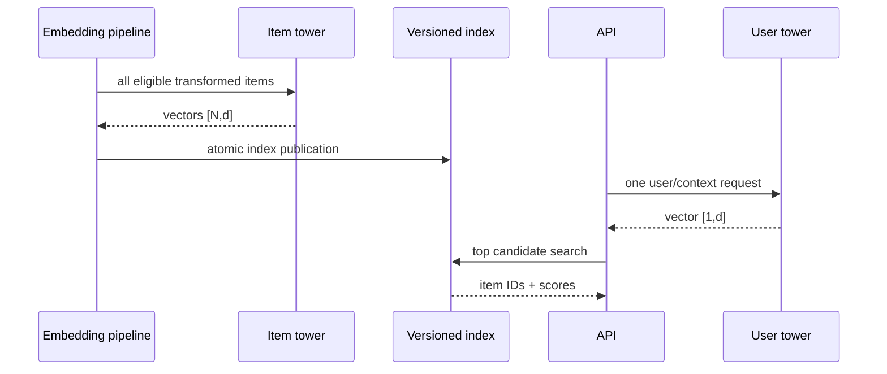

# Two-tower retrieval: theory and mechanics

Two-tower models learn separate functions for the request side and candidate side. Their power is
not merely that “embeddings capture similarity”; the training objective shapes a shared geometry in
which observed positives must outrank sampled alternatives.

## Independent encoders

Let user/query features be \(x_u\) and item features be \(x_i\). The towers are

\[
z_u = f_\theta(x_u), \qquad z_i = g_\phi(x_i)
\]

where \(f_\theta\) and \(g_\phi\) do not exchange activations. Each combines categorical embeddings,
normalized numbers, and projected hidden layers into the same \(d\)-dimensional space.

With L2 normalization:

\[
e_u = \frac{z_u}{\max(\lVert z_u \rVert_2, \epsilon)}, \qquad
e_i = \frac{z_i}{\max(\lVert z_i \rVert_2, \epsilon)}
\]

and the score is

\[
s(u,i)=e_u^\top e_i=\cos(e_u,e_i) \in [-1,1].
\]

For unnormalized dot product, \(s(u,i)=z_u^\top z_i\). Vector magnitude can then encode confidence
or popularity, but also creates scale drift and norm-based shortcuts. Normalized vectors simplify
ANN behavior and make score meaning more stable; unnormalized vectors may be useful when magnitude
is deliberately modeled and monitored.

## Feature flow inside the towers



Padding index 0 is excluded from pooled preference values. Unknown index 1 provides a stable route
for unseen or missing categories. Xavier initialization prevents initially extreme activations;
LayerNorm stabilizes each example without depending on batch statistics.

## In-batch softmax

For a batch of \(B\) positive pairs \((u_j,i_j)\), form the score matrix

\[
S_{jk}=\frac{s(u_j,i_k)}{\tau},
\]

where \(\tau>0\) is temperature. The row-wise probability is

\[
p(i_k\mid u_j)=\frac{\exp(S_{jk})}{\sum_{m=1}^{B}\exp(S_{jm})}.
\]

For a single positive diagonal, the asymmetric loss is

\[
\mathcal{L}_{u\rightarrow i}=-\frac{1}{B}\sum_{j=1}^{B}\log p(i_j\mid u_j).
\]

The optional symmetric objective also retrieves users from items:

\[
\mathcal{L}_{sym}=\frac{1}{2}
\left(\mathcal{L}_{u\rightarrow i}+\mathcal{L}_{i\rightarrow u}\right).
\]

This repository defaults to the asymmetric user-to-item objective because serving performs that
direction. Symmetry can improve shared geometry but adds a task that may not match product use.

## Duplicate positives and multi-positive targets

Suppose two rows contain the same positive item:

```text
row 0: user A -> item X
row 1: user B -> item X
row 2: user C -> item Y
```

A naive diagonal cross-entropy calls `item X` in column 1 a negative for user A even though it is
the same identity as A's positive. The implemented loss constructs a positive mask by item identity
and distributes target mass across all matching columns. For positive set \(P_j\):

\[
\mathcal{L}_j=-\log\frac{\sum_{k\in P_j}\exp(S_{jk})}
{\sum_{m=1}^{B}\exp(S_{jm})}.
\]

This addresses duplicate item identities inside the batch. It does not prove that every other item
is a true negative; false negatives caused by unobserved preference remain a sampling problem.

## Temperature

Temperature scales logits before softmax:

| Temperature | Geometry pressure | Typical failure mode |
|---|---|---|
| Too high | Probabilities stay flat | Slow learning; positives do not separate |
| Moderate | Useful relative gradients | Stable default region |
| Too low | Small score differences become extreme | Instability, brittle hard-negative gradients |

For normalized vectors, raw scores are bounded, so temperature determines much of the effective
logit range. It is a model hyperparameter and must match between training interpretation and
evaluation expectations.

## Regularization

The optimizer applies weight decay:

\[
\mathcal{L}_{total}=\mathcal{L}_{retrieval}
+\lambda\sum_w \lVert w\rVert_2^2.
\]

Dropout regularizes hidden representations, gradient clipping bounds extreme updates, and early
stopping limits overfitting to the validation period. L2 output normalization is not weight
regularization; it constrains the retrieval representation itself.

## Why independent towers scale

For \(N\) catalog items and \(Q\) requests, a joint model may require \(O(QN)\) expensive forward
passes. Two towers require approximately:

\[
O(N\cdot C_i) \text{ offline} + O(Q\cdot(C_u+C_{ANN})) \text{ online},
\]

where \(C_i\) and \(C_u\) are tower costs and \(C_{ANN}\) is sublinear or efficiently indexed
search. Item vectors can be rebuilt asynchronously and reused across many requests.



## Embedding collapse and shortcut learning

Collapse means representations occupy too little of the space or become nearly identical. Symptoms
include low variance, cosine scores concentrated near one value, falling coverage, and popularity-
dominated results. Causes include weak negatives, excessive regularization, data duplication, or a
feature shortcut such as raw popularity overwhelming other signals.

Monitor:

- mean and variance of user/item norms before and after normalization;
- pairwise similarity distributions for positive and sampled pairs;
- per-dimension variance and effective rank;
- catalog coverage and head/tail retrieval rates;
- feature ablations, especially item ID and popularity.

## Worked miniature example

Assume a normalized user vector \([0.8,0.6]\), a positive item \([1,0]\), and two alternatives
\([0,1]\) and \([-0.8,0.6]\). Scores are \(0.8\), \(0.6\), and \(-0.28\). With
\(\tau=0.2\), logits are \(4.0\), \(3.0\), and \(-1.4\), giving the positive substantially more
probability than either alternative. The gradient still pushes the close second item away more
strongly than the easy third item. This is why hard negatives carry more learning signal—and why a
false hard negative can be damaging.

## When not to use a two-tower model

Do not choose this architecture when the catalog is tiny enough for exact rich scoring, when the
decision depends primarily on non-factorizable user-item cross features, when the result must obey
complex slate constraints during candidate generation, or when labels are too sparse to learn a
meaningful shared geometry. Hybrid retrieval—lexical, graph, editorial, rules, multiple embedding
spaces—is often safer than relying on one tower pair.

