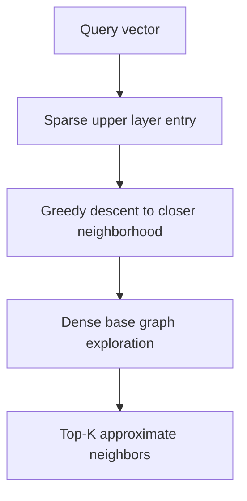
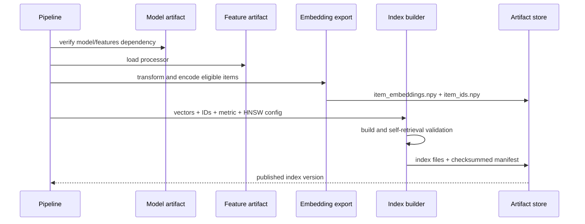
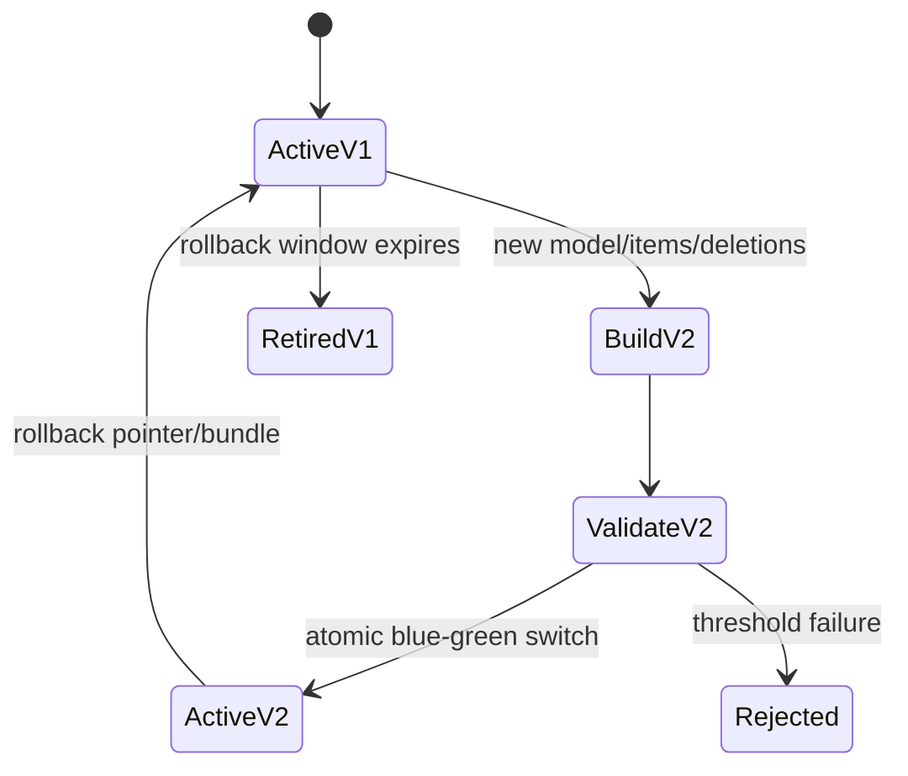

# Vector search and index lifecycle

Vector search converts a user embedding into candidate item IDs. The repository provides an exact
inner-product oracle and a FAISS HNSW implementation behind the same protocol.

## Search contract

```python
class VectorIndex(Protocol):
    item_ids: numpy.ndarray
    dimension: int

    def search(self, queries: numpy.ndarray, k: int) -> tuple[numpy.ndarray, numpy.ndarray]: ...
```

Queries are a two-dimensional float32 matrix `[batch, embedding_dimension]`. Implementations return
score and ID matrices `[batch, k]`, reject dimension mismatch, and safely bound K to catalog size.

## Exact search

The exact backend computes:

\[
S=QI^\top
\]

then partially sorts each row for top-K. It provides deterministic correctness and is ideal for
tests, small catalogs, and ANN recall measurement. Its cost and memory bandwidth scale linearly with
catalog size per query.

## FAISS HNSW

Hierarchical Navigable Small World search builds a multilayer proximity graph.



Configured controls:

| Parameter | Build/query effect | Trade-off |
|---|---|---|
| `hnsw_m` | Maximum graph connectivity | Higher recall and memory/build cost |
| `hnsw_ef_construction` | Candidate breadth during graph build | Better graph, slower build |
| `hnsw_ef_search` | Candidate breadth per query | Better recall, higher latency |
| `search_candidates` | Runtime over-fetch before policies | More room after filters, more search/rerank work |

HNSW is memory-resident and supports useful incremental insertion, but deletions and large-scale
update governance are not free. This project publishes immutable rebuilt indexes for deterministic
rollback.

## Similarity compatibility

With normalized vectors, FAISS inner product implements cosine ranking. With unnormalized vectors,
inner product is dot-product ranking and vector norms matter. Configuration validation requires
`model.similarity == index.metric`; index manifests also record dimension and upstream versions.

Do not normalize vectors at only one side or only at index build time. That creates training-serving
skew even when dimensions match.

## Build pipeline



Item IDs are stored as fixed-width Unicode arrays and loaded with `allow_pickle=False`. Index
loading verifies artifact checksums and model dependency before exposing the search object.

## Validation

Self-retrieval queries a sample of item vectors and checks that each item's nearest neighbor is
itself. This detects ID/vector misalignment and severe persistence errors. It is necessary but not
sufficient: it does not measure representative ANN recall under user queries.

Production validation should include:

1. checksum and manifest validation;
2. item count/dimension/metric compatibility;
3. self-retrieval and duplicate ID checks;
4. ANNRecall@K versus exact user queries;
5. p50/p95/p99 latency under concurrent load;
6. resident memory and load time;
7. head, tail, and new-item recall;
8. filter over-fetch sufficiency.

## Updates, deletion, and rollback



Full rebuilds provide the cleanest version contract. New-item insertions can be batched into an
incremental index only if the model/processor remain identical. Deleted items should be tombstoned
in the serving eligibility layer immediately, then physically removed in the next rebuild.

## Alternative backends

The protocol can support OpenSearch/Elasticsearch k-NN, Milvus, Pinecone, Weaviate, Qdrant,
pgvector, or another managed service. An adapter must preserve score semantics, stable ID mapping,
timeouts, filtering rules, version routing, and exact compatibility checks. Managed search changes
the operational boundary; it does not remove the need for offline recall measurement.

```bash
uv run recommender export-item-embeddings --config configs/demo.yaml
uv run recommender build-index --config configs/demo.yaml
uv run recommender validate-index --config configs/demo.yaml
```

